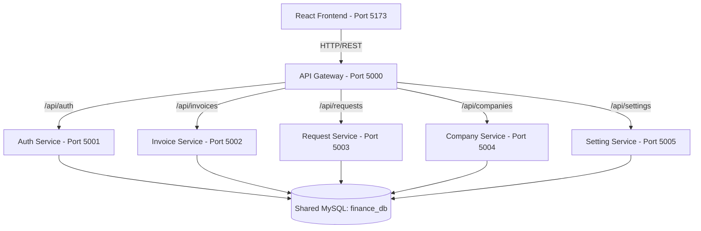
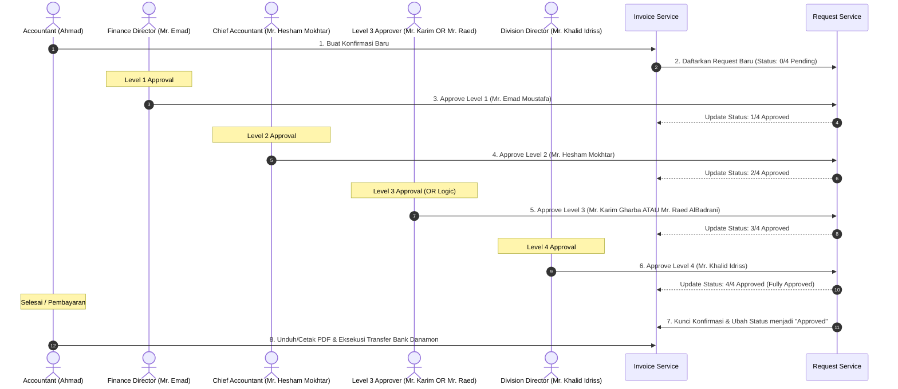

# 💼 Manazil AL.Mukhtara Group - Finance System

Sistem Keuangan Terintegrasi (Finance System) **Manazil AL.Mukhtara Group** adalah platform berbasis web yang dirancang khusus untuk mengelola operasional keuangan, pencatatan transaksi, katalog layanan pariwisata/umrah, manajemen kantor cabang, serta sistem persetujuan faktur (invoice approval) multi-tahap.

Aplikasi ini menggunakan arsitektur **Microservices** di sisi backend untuk modularitas tinggi dan performa optimal, serta **Single Page Application (SPA)** di sisi frontend untuk antarmuka pengguna yang dinamis, interaktif, dan premium.

---

## 🛠️ Arsitektur Teknologi

Sistem dibangun dengan menggunakan teknologi modern untuk menjamin performa, keamanan, dan skalabilitas:



### 1. Backend (Microservices)
Setiap layanan backend dibangun menggunakan **Node.js (Express framework, ESM)** dan berkomunikasi secara independen ke database MySQL bersama (`finance_db`).
*   **`api-gateway` (Port 5000)**: Pintu masuk utama (reverse proxy) yang menyatukan seluruh layanan backend menggunakan `http-proxy-middleware` dan mengelola CORS untuk komunikasi dengan frontend.
*   **`auth-service` (Port 5001)**: Menangani pendaftaran, login, autentikasi berbasis JSON Web Token (JWT), enkripsi kata sandi menggunakan `bcryptjs`, pencatatan log masuk, sesi pengguna, serta pengiriman email notifikasi (`nodemailer`).
*   **`invoice-service` (Port 5002)**: Mengelola pencatatan invoice masuk dan detail rincian item transaksi belanja.
*   **`request-service` (Port 5003)**: Pusat logika bisnis untuk pengajuan dan pemrosesan approval bertingkat (3 level approval).
*   **`company-service` (Port 5004)**: Mengelola data entitas atau mitra bisnis/klien (perusahaan eksternal).
*   **`setting-service` (Port 5005)**: Mengelola konfigurasi sistem meliputi pengelolaan tim, kantor cabang operasional, preferensi notifikasi, nilai tukar mata uang asing harian (USD, SAR, IDR), profil pengguna, keamanan, dan katalog harga layanan standar.

### 2. Frontend (Single Page Application)
Aplikasi antarmuka pengguna dibangun dengan:
*   **React (v19)** & **TypeScript** untuk pengembangan antarmuka terstruktur dan aman.
*   **Vite** sebagai build tool super cepat.
*   **Tailwind CSS** untuk desain tata letak UI yang modern dan responsif.
*   **React Router Dom** untuk navigasi halaman tanpa reload.
*   **Axios** untuk integrasi panggilan API terpusat.
*   **Lucide React** sebagai pustaka ikon visual premium.## ✨ Fitur Utama Sistem Keuangan (Pembaruan Terkini)

Sistem keuangan ini telah dilengkapi dengan fitur-fitur mutakhir untuk menyokong efisiensi tim internal dan keamanan data:

1. **User-Facing Rename to "Confirmations"**:
   * Seluruh teks antarmuka pengguna (UI), tabel ledger, kolom pencarian, tombol, laporan, dan dokumen cetakan yang sebelumnya bertuliskan **"Invoice"** kini telah diperbarui secara global menjadi **"Confirmation"** / **"Confirmations"** untuk menyelaraskan dengan kebutuhan operasional perusahaan.

2. **Sistem Persetujuan Mandiri 4-Level & Logika OR**:
   * Alur persetujuan diperluas menjadi **4 Level**: `0/4 Pending -> 1/4 -> 2/4 -> 3/4 -> 4/4 Approved`.
   * Khusus pada **Level 3**, sistem menggunakan logika **OR (ATAU)**. Persetujuan dapat dilakukan oleh Mr. Karim Gharba **ATAU** Mr. Raed AlBadrani. Persetujuan salah satu dari mereka langsung meloloskan request ke Level 4 (Mr. Khalid Idriss).


3. **Log Catatan Persetujuan & Unggah Bukti**:
   * Setiap approver dapat menambahkan alasan/catatan keputusan saat menyetujui, yang akan tersimpan dalam kolom `levelXNote` di database.
   * Dilengkapi fitur unggah bukti transfer pembayaran dengan kompresi gambar otomatis di sisi klien sebelum diunggah ke backend.

4. **Kemitraan Klien & Manajemen Agent (Opsional)**:
   * Pendaftaran perusahaan klien dilengkapi dropdown **Agent** resmi: `Hasoob Technology Trading - 2067` dan `ODST Travel and Tourism - 2114`.
   * *Terbaru*: Pilihan Agent kini bersifat **opsional**. Pengguna dapat mendaftarkan perusahaan dengan memilih opsi `None (No Agent)`. Jika dipilih, agen akan bernilai NULL di database, dan ditampilkan sebagai `"N/A"` di detail/print invoice.

5. **Multi-Currency & Kurs Konversi Otomatis (USD, SAR, Rp)**:
   * *Terbaru*: Halaman pembuatan invoice (Itemized Charges) sekarang memiliki **Currency Selector** dropdown dengan pilihan `Rp (Rupiah)`, `SAR (Riyal)`, dan `USD (Dolar AS)`.
   * Memilih mata uang akan secara otomatis mengonversi seluruh item belanja yang diinput berdasarkan nilai kurs exchange rate harian terkini.
   * Saat memilih layanan terkonfigurasi (misalnya VISA, Transport), harga standard dikonversi otomatis ke mata uang invoice terpilih.
   * Laporan keuangan di dashboard utama dan breakdown profitabilitas perusahaan secara otomatis mengonversi kembali seluruh tagihan non-USD ke nilai USD berdasarkan kurs spesifik yang tersimpan pada invoice agar pelacakan global tetap konsisten.

6. **Batal Otomatis (Auto-Cancel)**:
   * Logika backend memantau secara real-time status pembayaran tagihan; setiap tagihan yang belum dibayar melewati batas *Due Date* akan otomatis diubah statusnya menjadi **`Cancelled`** di database.

---

## 🗄️ Struktur Database (MySQL)

Sistem menggunakan database relational **MySQL** dengan tabel berawalan `dst_`:

| Nama Tabel | Deskripsi Data | Layanan Pengelola |
| :--- | :--- | :--- |
| `dst_users` | Menyimpan kredensial pengguna, peran (seperti `Level_3_Approver`), kantor cabang, dan data profil. | `auth-service` / `setting-service` |
| `dst_sessions` | Menyimpan riwayat sesi perangkat aktif pengguna saat ini. | `auth-service` / `setting-service` |
| `dst_login_logs` | Menyimpan catatan audit log masuk (IP, browser, status). | `auth-service` |
| `dst_notifications` | Menyimpan pesan pemberitahuan in-app untuk pengguna. | `auth-service` |
| `dst_companies` | Menyimpan daftar perusahaan klien beserta kolom `agent`. | `company-service` |
| `dst_invoices` | Menyimpan data header konfirmasi (nomor, total biaya, rate konversi, tanggal pembuatan, jatuh tempo, bukti bayar). | `invoice-service` |
| `dst_invoice_items` | Menyimpan baris detail barang/layanan dalam setiap konfirmasi (Relasi One-to-Many). | `invoice-service` |
| `dst_requests` | Menyimpan status pengajuan persetujuan 4 level (`level1Note` - `level4Note` dan waktu ttd). | `request-service` |
| `dst_branches` | Menyimpan data kantor cabang operasional perusahaan di Indonesia. | `setting-service` |
| `dst_notification_settings` | Menyimpan preferensi notifikasi tiap user (Email/In-App). | `setting-service` |
| `dst_exchange_rates` | Menyimpan data nilai tukar mata uang terkini (USD/SAR/IDR). | `setting-service` |
| `dst_exchange_rates_history` | Menyimpan riwayat perubahan nilai tukar harian (audit log). | `setting-service` |
| `dst_services` | Menyimpan katalog jenis layanan standar beserta mata uangnya (Visa, Transport, Handling - USD/SAR/IDR). | `setting-service` |
| `dst_company_settings` | Menyimpan konfigurasi profil identitas perusahaan beserta data rekening bank dinamis (Nama Bank, Nomor Rekening IDR/USD, dll). | `setting-service` |

---

## 🔄 Alur Kerja Aplikasi (Application Workflow)

Alur kerja operasional utama sistem keuangan ini dirancang untuk menjaga transparansi dan validasi transaksi:



### 1. Otentikasi dan Matriks Peran Pengguna
Pengguna harus masuk dengan salah satu peran (role) yang menentukan wewenang mereka dalam sistem persetujuan:
*   **Super Admin** (Direktur Keuangan / *Finance Director* - **Mr. Emad Moustafa**): Memiliki wewenang penuh atas konfigurasi sistem serta dapat memberikan persetujuan pada Level 1, 2, 3, maupun 4.
*   **Chief Accountant** (Kepala Akuntan - **Mr. Hesham Mokhtar**): Bertanggung jawab atas verifikasi kepatuhan keuangan pada Level 2.
*   **Level 3 Approver** (**Mr. Karim Gharba** & **Mr. Raed AlBadrani**): Bertanggung jawab atas verifikasi Level 3. Karim memiliki permission khusus `manage_companies`.
*   **Division Director** (Direktur Divisi Umrah - **Mr. Khalid Idriss**): Bertanggung jawab atas persetujuan akhir operasional pada Level 4.
*   **Accountant** (Staf Akuntan - **Ahmad Saleh**): Membuat konfirmasi, memantau persetujuan, dan mengunggah bukti pembayaran.

### 2. Siklus Persetujuan Multi-Tahap (4-Level Approval System)
1.  **Penginputan**: Staf Akuntan menginput konfirmasi baru atas transaksi belanja operasional atau pariwisata.
2.  **Pengajuan**: Sistem membuat draft konfirmasi dengan status awal **`0/4 Pending`**.
3.  **Proses Persetujuan Tingkat 1 (Level 1)**: Disetujui oleh **Super Admin** (Mr. Emad Moustafa). Status -> **`1/4 Approved`**.
4.  **Proses Persetujuan Tingkat 2 (Level 2)**: Disetujui oleh **Chief Accountant** (Mr. Hesham Mokhtar) atau Super Admin. Status -> **`2/4 Approved`**.
5.  **Proses Persetujuan Tingkat 3 (Level 3)**: Disetujui oleh salah satu **Level 3 Approver** (Mr. Karim Gharba **ATAU** Mr. Raed AlBadrani) atau Super Admin. Status -> **`3/4 Approved`**.
6.  **Proses Persetujuan Tingkat 4 (Level 4)**: Disetujui oleh **Division Director** (Mr. Khalid Idriss) atau Super Admin. Status -> **`4/4 Approved`** (Fully Approved).
7.  **Pemberatan Keputusan (Rejection)**: Staf Accountant **tidak diizinkan** menolak pengajuan. Jika salah satu approver memilih *Reject*, status langsung dikunci menjadi **`Rejected`** dan alur dihentikan.

### 3. Eksekusi Pembayaran & Cetak Faktur
*   Sebelum konfirmasi berstatus **`4/4 Approved`**, fitur **Cetak (Print)** dan **Unduh PDF** dalam keadaan terkunci (locked).
*   Setelah status mencapai **`4/4 Approved`**, tombol cetak dan unduh aktif secara otomatis.
*   Akuntan dapat mengunduh dokumen resmi yang menyertakan metadata tanda tangan digital (waktu persetujuan dari masing-masing level) serta instruksi transfer pembayaran ke Bank Danamon PT ODST Airlines Indo.
*   Setelah pembayaran dilakukan, akuntan mengunggah bukti bayar untuk mengubah status menjadi *Paid*.

---

## 🚀 Panduan Memulai (Quick Start)

### Prasyarat
*   **Node.js** (Minimal v18+)
*   **MySQL Server**
*   **Docker & Docker Compose** (Opsional, untuk deployment mudah)

### Opsi 1: Menjalankan Aplikasi di Lingkungan Pengembangan Lokal (Local Dev Mode)
1. **Instalasi Dependensi**:
   Jalankan perintah berikut di root folder proyek:
   ```bash
   npm run install:all
   ```
2. **Konfigurasi Lingkungan (.env)**:
   Buat file `.env` di masing-masing folder microservice (`backend/auth-service/`, dll) dan `finance-frontend/`.
3. **Jalankan Aplikasi secara Bersamaan**:
   ```bash
   npm run dev
   ```
   Akses antarmuka sistem keuangan di alamat: **`http://localhost:5173`**.

### Opsi 2: Menjalankan / Mendeploy Aplikasi Menggunakan Docker Compose (Terpadu)
Aplikasi ini sudah dilengkapi dengan Dockerfiles untuk setiap service dan satu file `docker-compose.yml` utama di root.
1. **Lengkapi File `.env`** pada masing-masing folder microservice.
2. **Jalankan Aplikasi**:
   ```bash
   docker compose up --build -d
   ```
   *(Untuk detail deployment menggunakan Docker Compose di VPS Hostinger dan Coolify Panel, silakan baca [vps_coolify_deployment_guide.md](file:///d:/Manazil%20AL.Mukhtara%20Group/FinanceSystem/vps_coolify_deployment_guide.md)).*

---
*Dokumentasi ini dibuat untuk mempermudah onboarding pengembang dan memberikan gambaran menyeluruh terhadap sistem keuangan Manazil AL.Mukhtara Group.*
