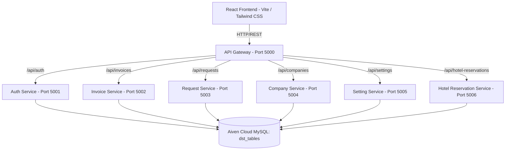
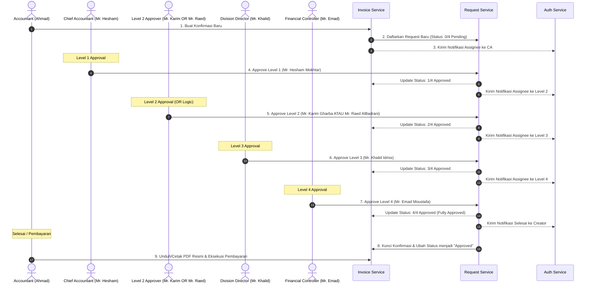

# 💼 Manazil AL.Mukhtara Group - Finance System

Sistem Keuangan Terintegrasi (Finance System) **Manazil AL.Mukhtara Group** adalah platform berbasis web enterprise yang dirancang khusus untuk mengelola operasional keuangan, pencatatan transaksi, reservasi hotel & akomodasi umrah/haji, katalog layanan pariwisata, manajemen kantor cabang, backup data sistem, riwayat pembayaran bertahap (*installments*), notifikasi otomatis (*In-App & Email*), serta sistem persetujuan faktur (*Confirmation Approval*) multi-tahap.

Aplikasi ini menggunakan arsitektur **Microservices** di sisi backend untuk modularitas tinggi dan performa optimal, serta **Single Page Application (SPA)** di sisi frontend untuk antarmuka pengguna yang dinamis, interaktif, responsif, dan premium.

---

## 🛠️ Arsitektur Teknologi

Sistem dibangun dengan menggunakan teknologi modern untuk menjamin performa, keamanan, dan skalabilitas tinggi:



### 1. Backend (Microservices)
Setiap layanan backend dibangun menggunakan **Node.js (Express framework, ESM)** dan berkomunikasi secara independen ke database Aiven Cloud MySQL bersama (`dst_tables`):
* **`api-gateway` (Port 5000)**: Pintu masuk utama (*reverse proxy*) yang menyatukan seluruh layanan backend menggunakan `http-proxy-middleware` dan mengelola CORS untuk komunikasi dengan frontend.
* **`auth-service` (Port 5001)**: Menangani registrasi, login, autentikasi berbasis JSON Web Token (JWT), enkripsi kata sandi menggunakan `bcryptjs`, audit log masuk, pelacakan sesi pengguna, serta pusat pengiriman email notifikasi (`nodemailer` / SMTP).
* **`invoice-service` (Port 5002)**: Mengelola pencatatan invoice/konfirmasi masuk, rincian item transaksi belanja, riwayat pembayaran bertahap (*multi-payment installments*), serta kredit saldo overpayment perusahaan.
* **`request-service` (Port 5003)**: Pusat logika bisnis untuk pengajuan dan pemrosesan approval bertingkat (4-level approval system) serta cron checker jatuh tempo untuk antrean persetujuan.
* **`company-service` (Port 5004)**: Mengelola data entitas atau mitra bisnis/klien (perusahaan eksternal) serta saldo kredit (*credit balance*).
* **`setting-service` (Port 5005)**: Mengelola konfigurasi sistem meliputi manajemen tim, kantor cabang operasional, preferensi notifikasi pengguna, nilai tukar mata uang asing harian (USD, SAR, IDR), profil pengguna, keamanan akun, backup sistem, dan katalog harga layanan standar.
* **`hotel-reservation-service` (Port 5006)**: Mengelola seluruh siklus reservasi hotel, daftar kamar & akomodasi, verifikasi persetujuan oleh Mr. Karim Gharba, unggah bukti transfer/invoice, riwayat pembayaran kamar, serta cron checker jatuh tempo dan auto-cancellation hotel.

### 2. Frontend (Single Page Application)
Aplikasi antarmuka pengguna dibangun dengan:
* **React (v19)** & **TypeScript** untuk pengembangan antarmuka terstruktur, modular, dan type-safe.
* **Vite** sebagai build tool ultra-cepat.
* **Tailwind CSS** untuk desain tata letak UI yang modern, responsif, dan elegan.
* **React Router Dom** untuk navigasi halaman tanpa reload.
* **Axios** untuk integrasi panggilan API terpusat dengan interceptor otentikasi JWT.
* **Lucide React** sebagai pustaka ikon visual premium.

---

## ✨ Fitur Utama Sistem Keuangan (Pembaruan Terkini)

Sistem keuangan ini telah dilengkapi dengan fitur-fitur mutakhir untuk menyokong efisiensi tim internal dan keamanan data:

### 1. Perhitungan Real-Time Total Revenue (Collected Cash Inflow)
* **Collected Cash Standard**: Kartu *Total Revenue* di dashboard menghitung arus kas riil yang telah diterima (100% dari invoice/konfirmasi yang telah approved/paid penuh **ditambah** porsi nominal yang telah dibayarkan pada invoice berstatus partial payment / deposit).
* **Outstanding Balance Otomatis**: Tagihan dengan status partial payment secara otomatis hanya menghitung sisa saldo yang belum terbayar (*remaining balance*), bukan lagi menagih nominal kotor secara utuh.
* **Status Badges Baru**: Tabel konfirmasi terbaru kini dilengkapi badge informatif: `Fully Paid` (hijau), `Partial Payment` (biru), dan `Deposit Paid` (amber/kuning).

### 2. Sistem Notifikasi Otomatis Menyeluruh (In-App & Email)
* **Kustomisasi Preferensi Mandiri**: Setiap pengguna dapat mengatur preferensi penerimaan notifikasi via In-App (lonceng header & audio alert) dan/atau Email resmi di menu **Settings ➔ Notifications** (`dst_notification_settings`).
* **Kategori Notifikasi**:
  * **Confirmation Notifications**:
    * *New confirmation submitted*: Diberitahukan kepada pimpinan/direktur saat staff menerbitkan konfirmasi baru.
    * *Confirmation approved*: Diberitahukan kepada pembuat invoice saat dokumen disetujui penuh.
    * *Confirmation rejected*: Diberitahukan kepada pembuat invoice beserta alasan penolakan jika dikembalikan untuk revisi.
    * *Payment received*: Diberitahukan saat status transaksi lunas atau saat pembayaran cicilan/DP dicatat.
  * **Approval Notifications**:
    * *Approval request assigned*: Diberitahukan kepada approver saat giliran approval tiba di meja kerjanya.
    * *Approval completed*: Diberitahukan kepada approver level sebelumnya saat tim downstream meloloskan verifikasi.
    * *Approval overdue*: Dijalankan secara otomatis oleh cron job harian jika approval melewati batas waktu.
  * **System Notifications**:
    * *Security alerts*: Peringatan keamanan otomatis saat terjadi kegagalan login atau deteksi login dari IP baru.
    * *Team member changes*: Notifikasi ke Super Admin saat ada penambahan atau penghapusan pengguna di sistem.
    * *System maintenance*: Pengumuman jadwal pemeliharaan platform.

### 3. Background Cron Job Terjadwal (Dedicated Overdue Checkers)
* **`request-service` Cron (`overdueChecker.js`)**:
  * Berjalan setiap hari pada pukul **08:00 AM** (`0 8 * * *`).
  * Memeriksa antrean approval invoice/konfirmasi (`dst_requests`) yang melewati tanggal `dueDate` dan mengirimkan alert `approvalOverdue` ke approver terkait.
* **`hotel-reservation-service` Cron (`overdueChecker.js`)**:
  * Berjalan mandiri setiap hari pada pukul **08:00 AM** (`0 8 * * *`).
  * Memindai reservasi hotel aktif (`dst_hotel_reservations`) yang belum lunas dan telah melewati batas `dueDate`.
  * Secara otomatis memperbarui status menjadi **Cancelled** (*Auto-Cancelled: Unpaid past due date*) dan mengirimkan alert `approvalOverdue` kepada Mr. Karim, Super Admin, dan pembuat reservasi dengan proteksi anti-duplikasi.

### 4. Modul Hotel Reservations & Cetak PDF Presisi
* **Tab "Reservations" vs "Requests"**: Tab reservasi menampilkan data operasional aktif (`Confirmed`, `Tentative`, `Paid`, `Overdue`, `Cancelled`). Tab requests mencatat seluruh riwayat permintaan awal.
* **Alur Approval Mandiri Mr. Karim**: Verifikasi khusus reservasi kamar hotel oleh Mr. Karim Gharba dengan penerbitan nomor konfirmasi (`CNF-...`).
* **Format Dokumen Cetak Standar Internasional**:
  * Format PDF invoice dan reservasi mencantumkan blok tanda tangan resmi Financial Controller (*Mr. Emad Moustafa*).
  * Posisi **Due Date** diletakkan tepat di bawah garis tanda tangan Financial Controller.
  * Alamat dan metadata resmi terstandarisasi: *Graha Al Badgel, Jakarta, Indonesia 12740*.

### 5. Multi-Payment History & Overpayment Credit
* **Pencatatan Cicilan Bertahap**: Dukungan pencatatan pembayaran berulang/bertahap pada modul konfirmasi maupun reservasi hotel (`dst_payment_history`).
* **Kredit Lebih Bayar (*Overpayment Credit*)**: Jika akumulasi pembayaran melebihi nilai tagihan kotor, kelebihan dana dapat otomatis dialokasikan ke saldo kredit klien (*credit balance*) di `dst_companies` untuk digunakan pada transaksi mendatang.

### 6. Sistem Persetujuan 4-Level & Logika OR
* Alur persetujuan 4 Level terstruktur: `0/4 Pending -> 1/4 -> 2/4 -> 3/4 -> 4/4 Approved`.
* Khusus pada **Level 2**, sistem menerapkan **Logika OR (ATAU)**: persetujuan dapat disahkan oleh Mr. Karim Gharba **ATAU** Mr. Raed AlBadrani.
* Setiap level divalidasi ketat terhadap peran pengguna (`role`) yang sedang login.

### 7. Multi-Currency & Nilai Kurs Otomatis (USD, SAR, IDR)
* Dropdown Currency Selector (`USD`, `SAR`, `IDR`) pada pembuatan transaksi dengan konversi otomatis berdasarkan nilai kurs harian terkini.
* Seluruh metrik agregat di dashboard secara otomatis dinormalisasi kembali ke nilai USD.

---

## 🗄️ Struktur Database (MySQL)

Sistem menggunakan database relasional **Aiven Cloud MySQL** dengan tabel berawalan `dst_`:

| Nama Tabel | Deskripsi Data | Layanan Pengelola |
| :--- | :--- | :--- |
| `dst_users` | Kredensial pengguna, peran (*role*), kantor cabang, dan data profil. | `auth-service` / `setting-service` |
| `dst_sessions` | Riwayat sesi perangkat aktif pengguna. | `auth-service` / `setting-service` |
| `dst_login_logs` | Catatan audit aktivitas login (IP, User Agent, status). | `auth-service` |
| `dst_notifications` | Pesan notifikasi in-app untuk pengguna (title, message, unread status). | `auth-service` |
| `dst_notification_settings` | Preferensi toggle notifikasi tiap pengguna (Email & In-App per alert type). | `setting-service` |
| `dst_companies` | Daftar mitra/klien, kode agen, dan saldo kredit (*credit balance*). | `company-service` |
| `dst_invoices` | Header konfirmasi/invoice (nomor, total, kurs konversi, jatuh tempo, status, sisa saldo). | `invoice-service` |
| `dst_invoice_items` | Baris detail rincian barang/layanan dalam setiap konfirmasi. | `invoice-service` |
| `dst_payment_history` | Riwayat pencatatan pembayaran bertahap/cicilan untuk konfirmasi & hotel. | `invoice-service` / `hotel-reservation-service` |
| `dst_requests` | Status alur persetujuan 4 level (`level1Note` - `level4Note`, timestamp, approver). | `request-service` |
| `dst_branches` | Data kantor cabang operasional perusahaan. | `setting-service` |
| `dst_exchange_rates` | Data nilai kurs mata uang terkini (USD/SAR/IDR). | `setting-service` |
| `dst_exchange_rates_history` | Riwayat perubahan nilai kurs harian untuk audit trail. | `setting-service` |
| `dst_services` | Katalog harga dan jenis layanan standar pariwisata. | `setting-service` |
| `dst_company_settings` | Konfigurasi profil perusahaan dan nomor rekening perbankan. | `setting-service` |
| `dst_hotel_reservations` | Data reservasi hotel, kamar (*rooms JSON*), tamu, status verifikasi Karim, dan sisa saldo. | `hotel-reservation-service` |

---

## 🔄 Alur Kerja Persetujuan (Approval Workflow)



---

## 🚀 Panduan Memulai (Quick Start)

### Prasyarat
* **Node.js** (Minimal v18+)
* **MySQL Server** (Aiven Cloud MySQL atau MySQL Server lokal)
* **Git**

### 1. Instalasi Dependensi
Jalankan perintah berikut di direktori root proyek untuk menginstal seluruh dependensi backend dan frontend secara otomatis:
```bash
npm run install:all
```

### 2. Konfigurasi Lingkungan (.env)
Pastikan berkas `.env` telah dikonfigurasi pada masing-masing microservice dan frontend:
* `backend/auth-service/.env`
* `backend/invoice-service/.env`
* `backend/request-service/.env`
* `backend/company-service/.env`
* `backend/setting-service/.env`
* `backend/hotel-reservation-service/.env`
* `backend/api-gateway/.env`
* `finance-frontend/.env`

### 3. Menjalankan Aplikasi dalam Mode Pengembangan (Dev Mode)
Jalankan perintah berikut di root folder untuk menyalakan seluruh 7 microservice dan frontend secara bersamaan:
```bash
npm run dev
```
Setelah aktif:
* **Frontend**: Buka [http://localhost:5173](http://localhost:5173) di browser Anda.
* **API Gateway**: Berjalan pada `http://localhost:5000`.

### 4. Menjalankan Aplikasi Menggunakan Docker Compose (Produksi)
Untuk deployment terpadu menggunakan container Docker:
```bash
docker compose up --build -d
```

---

*Dokumentasi ini terus diperbarui seiring dengan evolusi fitur dan penyempurnaan sistem keuangan Manazil AL.Mukhtara Group.*
