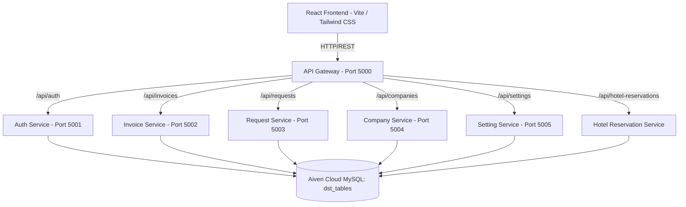
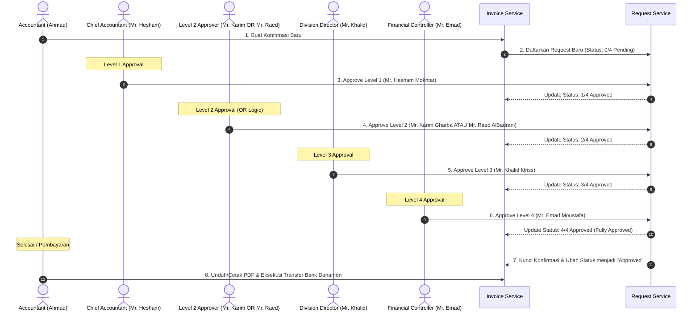

# 💼 Manazil AL.Mukhtara Group - Finance System

Sistem Keuangan Terintegrasi (Finance System) **Manazil AL.Mukhtara Group** adalah platform berbasis web yang dirancang khusus untuk mengelola operasional keuangan, pencatatan transaksi, reservasi hotel & akomodasi umrah/haji, katalog layanan pariwisata, manajemen kantor cabang, backup data sistem, serta sistem persetujuan faktur (*Confirmation Approval*) multi-tahap.

Aplikasi ini menggunakan arsitektur **Microservices** di sisi backend untuk modularitas tinggi dan performa optimal, serta **Single Page Application (SPA)** di sisi frontend untuk antarmuka pengguna yang dinamis, interaktif, dan premium.

---

## 🛠️ Arsitektur Teknologi

Sistem dibangun dengan menggunakan teknologi modern untuk menjamin performa, keamanan, dan skalabilitas:



### 1. Backend (Microservices)
Setiap layanan backend dibangun menggunakan **Node.js (Express framework, ESM)** dan berkomunikasi secara independen ke database Aiven Cloud MySQL bersama (`dst_tables`).
*   **`api-gateway` (Port 5000)**: Pintu masuk utama (*reverse proxy*) yang menyatukan seluruh layanan backend menggunakan `http-proxy-middleware` dan mengelola CORS untuk komunikasi dengan frontend.
*   **`auth-service` (Port 5001)**: Menangani pendaftaran, login, autentikasi berbasis JSON Web Token (JWT), enkripsi kata sandi menggunakan `bcryptjs`, pencatatan log masuk, sesi pengguna, serta pengiriman email notifikasi (`nodemailer`).
*   **`invoice-service` (Port 5002)**: Mengelola pencatatan invoice/konfirmasi masuk dan detail rincian item transaksi belanja.
*   **`request-service` (Port 5003)**: Pusat logika bisnis untuk pengajuan dan pemrosesan approval bertingkat (4-level approval system).
*   **`company-service` (Port 5004)**: Mengelola data entitas atau mitra bisnis/klien (perusahaan eksternal).
*   **`setting-service` (Port 5005)**: Mengelola konfigurasi sistem meliputi pengelolaan tim, kantor cabang operasional, preferensi notifikasi, nilai tukar mata uang asing harian (USD, SAR, IDR), profil pengguna, keamanan, backup sistem, dan katalog harga layanan standar.

### 2. Frontend (Single Page Application)
Aplikasi antarmuka pengguna dibangun dengan:
*   **React (v19)** & **TypeScript** untuk pengembangan antarmuka terstruktur dan aman.
*   **Vite** sebagai build tool super cepat.
*   **Tailwind CSS** untuk desain tata letak UI yang modern, responsif, dan elegan.
*   **React Router Dom** untuk navigasi halaman tanpa reload.
*   **Axios** untuk integrasi panggilan API terpusat.
*   **Lucide React** sebagai pustaka ikon visual premium.

---

## ✨ Fitur Utama Sistem Keuangan (Pembaruan Terkini)

Sistem keuangan ini telah dilengkapi dengan fitur-fitur mutakhir untuk menyokong efisiensi tim internal dan keamanan data:

1. **Modul Hotel Reservations (Manajemen Reservasi & Permintaan Hotel)**:
   * **Tab "Reservations"**: Menampilkan seluruh reservasi pasti & sedang berjalan (`Confirmed`, `Tentative`, `Paid`, `Overdue`, `Cancelled`). Reservasi yang ditandai sebagai **Paid** tetap dipertahankan di daftar dengan badge status biru **`PAID`**. Permintaan yang masih `Pending` difilter keluar dari tab ini.
   * **Tab "Requests"**: Menampilkan seluruh riwayat permintaan reservasi hotel tanpa terkecuali (`Pending`, `Confirmed`, `Paid and closed`, `Rejected`).
   * **Alur Approval Mr. Karim**: Mr. Karim Gharba memverifikasi dan menyetujui pengajuan permintaan reservasi hotel serta memasukkan nomor konfirmasi (`CNF-...`).
   * **Unggah Bukti Bayar Hotel**: Dilengkapi modal detail akomodasi hotel, pemecahan rincian kamar (*Accommodations Breakdown*), dan unggah bukti bayar gambar/PDF.

2. **User-Facing Rename to "Confirmations"**:
   * Seluruh teks antarmuka pengguna (UI), tabel ledger, kolom pencarian, tombol, laporan, dan dokumen cetakan yang sebelumnya bertuliskan **"Invoice"** telah diperbarui secara global menjadi **"Confirmation"** / **"Confirmations"**.

3. **System Data Backup & Infrastructure Export (Settings)**:
   * **Full System Backup (.json)**: Pengunduhan snapshot data lengkap dalam satu file JSON untuk pemulihan bencana (*disaster recovery*).
   * **Modular Data Export (CSV)**: Pengunduhan dataset spesifik dalam format CSV untuk *Invoices & Ledger*, *Hotel Reservations*, dan *Client Directory*.
   * **Hak Akses Ketat**: Fitur ini dibatasi khusus untuk Super Admin (**Mr. Emad Moustafa**) dan Tim IT Administrators (**Ali Warshan** & **Dimas Alva Rizki**).

4. **Silent Real-Time Sync & Skeleton Loading (Tanpa Kedipan/Flicker)**:
   * **Silent Sync**: Data disinkronkan secara *live* dengan Aiven Cloud MySQL setiap 10 detik dan saat jendela browser aktif tanpa memicu loading berulang (*flickering*).
   * **Skeleton Loading Pulse**: Animasi loading skeleton pulsa abu-abu yang halus diterapkan di seluruh 6 halaman utama (*Dashboard*, *Confirmations*, *Requests*, *Companies*, *Hotel Reservations*, *Settings*).

5. **Multi-Currency & Kurs Konversi Otomatis (USD, SAR, IDR)**:
   * Halaman pembuatan transaksi memiliki **Currency Selector** dropdown (`USD`, `SAR`, `IDR`).
   * Memilih mata uang akan secara otomatis mengonversi seluruh item belanja yang diinput berdasarkan nilai kurs exchange rate harian terkini.
   * Laporan keuangan di dashboard utama dan breakdown profitabilitas perusahaan secara otomatis mengonversi kembali seluruh tagihan ke nilai USD.

6. **Penyelarasan Anggota Tim (Requested By)**:
   * Kolom *Requested By* pada seluruh transaksi dan pengajuan secara ketat diselaraskan dengan daftar anggota tim resmi yang terdaftar di halaman Manage Team (`dst_users`).

7. **Sistem Persetujuan Mandiri 4-Level & Logika OR**:
   * Alur persetujuan 4 Level: `0/4 Pending -> 1/4 -> 2/4 -> 3/4 -> 4/4 Approved`.
   * Khusus pada **Level 2**, sistem menggunakan logika **OR (ATAU)**. Persetujuan dapat dilakukan oleh Mr. Karim Gharba **ATAU** Mr. Raed AlBadrani.
   * **Validasi Peran Ketat**: Setiap tingkat persetujuan wajib disetujui secara berurutan oleh pemilik peran masing-masing.

---

## 🗄️ Struktur Database (MySQL)

Sistem menggunakan database relational **Aiven Cloud MySQL** dengan tabel berawalan `dst_`:

| Nama Tabel | Deskripsi Data | Layanan Pengelola |
| :--- | :--- | :--- |
| `dst_users` | Menyimpan kredensial pengguna, peran, kantor cabang, dan profil. | `auth-service` / `setting-service` |
| `dst_sessions` | Menyimpan riwayat sesi perangkat aktif pengguna. | `auth-service` / `setting-service` |
| `dst_login_logs` | Menyimpan catatan audit log masuk (IP, browser, status). | `auth-service` |
| `dst_notifications` | Menyimpan pesan pemberitahuan in-app untuk pengguna. | `auth-service` |
| `dst_companies` | Menyimpan daftar perusahaan klien beserta kolom `agent`. | `company-service` |
| `dst_invoices` | Menyimpan data header konfirmasi (nomor, total biaya, rate konversi, tanggal pembuatan, jatuh tempo, bukti bayar). | `invoice-service` |
| `dst_invoice_items` | Menyimpan baris detail barang/layanan dalam setiap konfirmasi. | `invoice-service` |
| `dst_requests` | Menyimpan status pengajuan persetujuan 4 level (`level1Note` - `level4Note` dan waktu ttd). | `request-service` |
| `dst_branches` | Menyimpan data kantor cabang operasional perusahaan. | `setting-service` |
| `dst_notification_settings` | Menyimpan preferensi notifikasi tiap user. | `setting-service` |
| `dst_exchange_rates` | Menyimpan data nilai tukar mata uang terkini (USD/SAR/IDR). | `setting-service` |
| `dst_exchange_rates_history` | Menyimpan riwayat perubahan nilai tukar harian (audit log). | `setting-service` |
| `dst_services` | Menyimpan katalog jenis layanan standar beserta mata uangnya. | `setting-service` |
| `dst_company_settings` | Menyimpan konfigurasi profil identitas perusahaan & rekening bank. | `setting-service` |
| `dst_hotel_reservations` | Menyimpan data reservasi hotel, daftar kamar, tamu, nomor konfirmasi, dan bukti bayar. | `hotel-service` / `invoice-service` |

---

## 🔄 Alur Kerja Aplikasi (Application Workflow)



---

## 🚀 Panduan Memulai (Quick Start)

### Prasyarat
*   **Node.js** (Minimal v18+)
*   **MySQL Server** (Aiven Cloud / Local MySQL)
*   **Docker & Docker Compose** (Opsional, untuk deployment terpadu)

### Opsi 1: Menjalankan Aplikasi di Lingkungan Pengembangan Lokal (Local Dev Mode)
1. **Instalasi Dependensi**:
   Jalankan perintah berikut di root folder proyek:
   ```bash
   npm run install:all
   ```
2. **Konfigurasi Lingkungan (.env)**:
   Buat file `.env` di masing-masing folder microservice (`backend/auth-service/`, dll) dan `finance-frontend/`.
3. **Jalankan Aplikasi secara Bersamaan**:
   ```bash
   npm run dev
   ```
   Akses antarmuka sistem keuangan di alamat: **`http://localhost:5173`**.

### Opsi 2: Menjalankan / Mendeploy Aplikasi Menggunakan Docker Compose (Terpadu)
1. **Lengkapi File `.env`** pada masing-masing folder microservice.
2. **Jalankan Aplikasi**:
   ```bash
   docker compose up --build -d
   ```

---
*Dokumentasi ini dibuat untuk mempermudah onboarding pengembang dan memberikan gambaran menyeluruh terhadap sistem keuangan Manazil AL.Mukhtara Group.*
