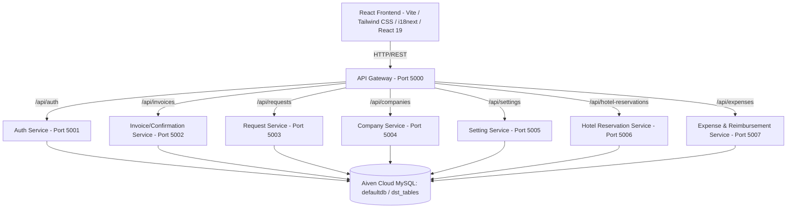
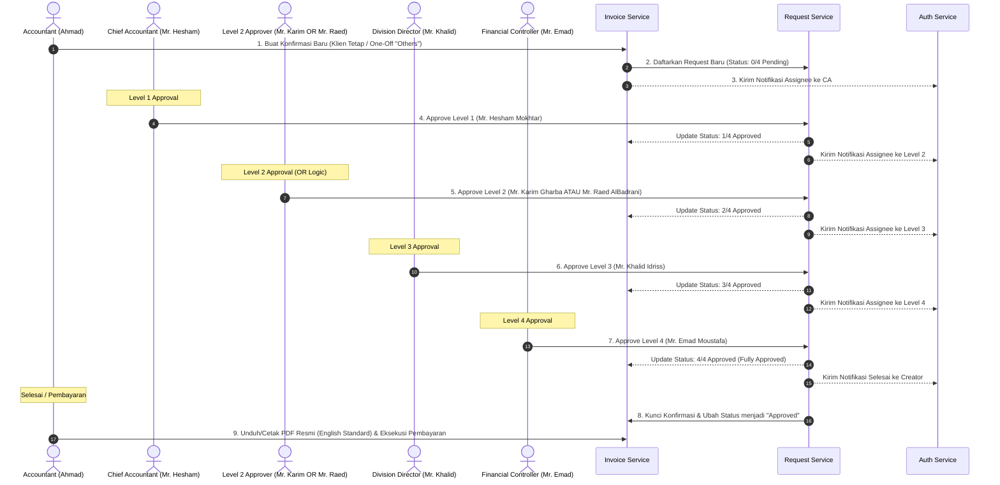
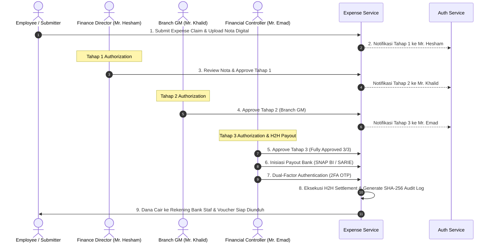

# 💼 Manazil AL.Mukhtara Group - Finance System

Sistem Keuangan Terintegrasi (Finance System) **Manazil AL.Mukhtara Group** adalah platform enterprise berbasis web modern yang dirancang khusus untuk mengelola operasional keuangan global, pencatatan konfirmasi transaksi (*Confirmations*), rekonsiliasi multi-valuta otomatis (*Multi-Currency Engine*), saldo kredit klien (*Client Credit Balance*), reservasi hotel & akomodasi umrah/haji, katalog layanan pariwisata, manajemen kantor cabang, backup data sistem, notifikasi otomatis (*In-App & Email*), input klien manual (*one-off client*), dukungan penuh 3 bahasa (*i18n: Indonesia, English, Arabic*), alur persetujuan konfirmasi 4-tahap (*Confirmation 4-Level Approval*), serta modul operasional internal (*Internal Expenses, 3-Tier Executive Authorization & Host-to-Host Bank Disbursement*).

Aplikasi ini menggunakan arsitektur **Microservices** di sisi backend untuk modularitas, ketahanan tinggi, dan skalabilitas optimal, serta **Single Page Application (SPA)** di sisi frontend untuk antarmuka pengguna yang dinamis, interaktif, responsif, dan berstandar internasional.

---

## 🛠️ Arsitektur Teknologi

Sistem dibangun dengan menggunakan teknologi terdepan untuk menjamin performa, keamanan, dan skalabilitas tinggi:



### 1. Backend (8 Microservices Architecture)
Setiap layanan backend dibangun menggunakan **Node.js (Express framework, ESM)** dan berkomunikasi secara independen ke database Aiven Cloud MySQL bersama (`dst_tables`):
* **`api-gateway` (Port 5000)**: Pintu masuk utama (*reverse proxy*) yang menyatukan seluruh layanan backend menggunakan `http-proxy-middleware`, mengelola CORS, dan merutekan request ke microservices terkait.
* **`auth-service` (Port 5001)**: Menangani registrasi, login, autentikasi berbasis JSON Web Token (JWT), enkripsi kata sandi dengan `bcryptjs`, audit log masuk, pelacakan sesi pengguna, serta pusat pengiriman email notifikasi (`nodemailer` / SMTP).
* **`invoice-service` (Port 5002)**: Mengelola pencatatan konfirmasi (*Confirmations*), klien *one-off* manual, rincian item transaksi, riwayat pembayaran bertahap (*multi-payment installments*), serta rekonsiliasi pembayaran multi-mata uang (*multi-currency conversion IDR/USD/SAR*).
* **`request-service` (Port 5003)**: Pusat logika bisnis untuk alur persetujuan bertingkat (*4-level approval system*) konfirmasi eksternal serta cron checker jatuh tempo untuk antrean persetujuan.
* **`company-service` (Port 5004)**: Mengelola master data mitra bisnis/klien korporat terdaftar serta pembaruan saldo kredit (*credit balance ledger*).
* **`setting-service` (Port 5005)**: Mengelola konfigurasi sistem meliputi manajemen tim, kantor cabang operasional, preferensi notifikasi pengguna, nilai tukar mata uang asing harian (USD, SAR, IDR), profil pengguna, keamanan akun, backup sistem, dan katalog harga layanan standar.
* **`hotel-reservation-service` (Port 5006)**: Mengelola seluruh siklus reservasi hotel, alokasi kamar & akomodasi, verifikasi persetujuan oleh Mr. Karim Gharba, unggah bukti transfer/invoice, riwayat pembayaran kamar, serta cron checker jatuh tempo dan auto-cancellation hotel.
* **`expense-service` (Port 5007)**: Pusat operasional klaim pengeluaran internal (*Internal Corporate Expenses*), penyimpanan nota digital, siklus verifikasi 3-tier eksekutif, data perbankan penerima reimbursement, dan audit log Host-to-Host settlement.

### 2. Frontend (Single Page Application)
Aplikasi antarmuka pengguna dibangun dengan:
* **React (v19)** & **TypeScript** untuk pengembangan antarmuka terstruktur, modular, dan type-safe.
* **Vite** sebagai build tool modern berkecepatan tinggi.
* **Tailwind CSS** untuk desain tata letak UI yang bersih, responsif, dan elegan.
* **i18next** & **react-i18next** untuk sistem lokalisasi trilingual instan (Indonesia, English, Arabic).
* **React Router Dom (v7)** untuk navigasi halaman SPA tanpa reload.
* **Axios** untuk integrasi panggilan API terpusat dengan interceptor otentikasi JWT.
* **Lucide React** sebagai pustaka ikon visual modern.

---

## ✨ Fitur Utama Sistem Keuangan

### 1. Modul Confirmations & Rekonsiliasi Multi-Valuta
* **Modul Confirmations Resmi**: Label menu dan modul diseragamkan menjadi **Confirmations** (*التأكيدات* dalam bahasa Arab dan *Konfirmasi* dalam bahasa Indonesia) untuk mencerminkan proses penerbitan konfirmasi resmi transaksi eksternal.
* **Rekonsiliasi Pembayaran Multi-Valuta (Cross-Currency Engine)**:
  * Pembayaran klien dalam mata uang berbeda (misal: klien membayar IDR / Rupiah pada invoice berdenominasi SAR atau USD) secara otomatis dikonversi ke mata uang dasar invoice menggunakan kurs transaksi harian.
  * Mencegah pembengkakan saldo kredit akibat ketidakcocokan mata uang (contoh: pembayaran Rp37.000.000 otomatis dikonversi menjadi ekuivalen SAR/USD sebelum menghitung sisa tagihan dan overpayment).
* **Opsi Klien One-Off ("Others")**: Pilihan fleksibel untuk membuat konfirmasi tanpa menyimpan ke master data mitra tetap `dst_companies`, menjaga kebersihan master data.
* **Format Penomoran Otomatis**: Transaksi klien manual otomatis menggunakan format nomor konfirmasi dengan prefix `OTH` (contoh: `OTH-0903-001`).

### 2. Modul Internal Expenses & Reimbursement (3-Tier Executive Approval & Bank BNI SNAP BI)
Sistem dilengkapi modul komprehensif untuk pengajuan, audit, dan persetujuan klaim pengeluaran internal:
* **My Expenses (`/my-expenses`)**: Melacak seluruh status pengajuan klaim biaya operasional staf secara real-time.
* **Submit Expense (`/submit-expense`)**: Formulir pengajuan klaim biaya baru lengkap dengan dropzone unggah bukti nota/kuitansi digital (*support PDF, JPG, PNG, WEBP maks 15MB*) dan rekening default Bank BNI.
* **Approvals Dashboard (`/approvals`)**: Pusat kendali audit bagi auditor keuangan dan approver eksekutif.
* **Rantai Otorisasi 3 Tingkat Eksekutif (3-Tier Executive Authorization Chain)**:
  1. **Tahap 1**: Mr. Hesham Mokhtar (*Finance Director*)
  2. **Tahap 2**: Mr. Khalid Idriss (*Branch General Manager*)
  3. **Tahap 3**: Mr. Emad Moustafa (*Financial Controller / Treasury*)
  * Hak persetujuan dikunci ketat per tahap (stage gating); setelah tahap 3 disetujui, klaim resmi berstatus **`Approved` / Disetujui Penuh**.
* **Integrasi Perbankan Bank BNI (SNAP BI Host-to-Host)**:
  * Sistem dipersiapkan terhubung ke gateway **PT Bank Negara Indonesia (Persero) Tbk (Bank BNI SNAP BI Corporate)**.
  * **Status Proses Pembayaran**: Proses eksekusi transfer bank otomatis saat ini ditahan (*on hold*) pada tahap 3-Tier Approval selesai sementara menunggu finalisasi API dari Bank BNI; pencairan dapat diproses secara manual atau payroll.
  * **Setup Beneficiary & Audit**: Konfigurasi inkuiri rekening bank dan pencetakan voucher transfer kriptografis SHA-256 terstandarisasi SNAP BI.
* **Dual-Environment Feature Flag (`VITE_ENABLE_INTERNAL`)**:
  * **Production Mode**: Bagian internal aman disembunyikan dengan label **`INTERNAL (coming soon)`** (Arab: `داخلي (قريباً)`).
  * **Testing Mode**: Mengaktifkan seluruh modul internal untuk evaluasi menyeluruh.

### 3. Dukungan Trilingual Penuh (Indonesia, English, Arabic)
* **3 Bahasa Resmi**: Sistem mendukung **Bahasa Indonesia (`id`)**, **English (`en`)**, dan **Arabic (`ar`)** dengan kesetaraan 100% di seluruh modul (Dashboard, Confirmations, Requests, Companies, Hotel Reservations, Settings, Expenses, Approvals, dan Modal Dialog).
* **RTL (Right-to-Left) Ready**: Tata letak antarmuka mendukung kenyamanan pengguna berbahasa Arab.
* **Proteksi Integritas Cetak PDF**: Seluruh dokumen cetak resmi (Konfirmasi, Laporan Finansial Cabang, Reservasi Hotel, Voucher Audit) **tetap 100% dalam bahasa Inggris standar internasional** tanpa terpengaruh oleh bahasa antarmuka UI.

### 4. Manajemen Saldo Kredit Klien & Reset Kontrol
* **Kredit Lebih Bayar (*Overpayment Credit Balance*)**: Kelebihan dana pembayaran invoice otomatis tercatat sebagai saldo kredit mitra pada tabel `dst_companies`.
* **Pengendalian Saldo Kredit di Direktori Perusahaan**: Tampilan profil perusahaan menampilkan ringkasan saldo kredit terkini dalam format mata uang SAR dengan opsi *Reset Saldo* untuk rekonsiliasi manual oleh staf keuangan.

### 5. Perhitungan Real-Time Total Revenue (Collected Cash Inflow)
* **Collected Cash Standard**: Kartu *Total Revenue* di dashboard menghitung arus kas riil yang telah diterima (100% dari konfirmasi yang telah approved/paid penuh **ditambah** porsi nominal yang telah dibayarkan pada invoice berstatus partial payment / deposit).
* **Outstanding Balance Otomatis**: Tagihan berstatus partial payment secara otomatis hanya menghitung sisa saldo yang belum terbayar (*remaining balance*).
* **Status Badges Informatif**: Tabel konfirmasi dilengkapi badge informatif: `Fully Paid` (hijau), `Partial Payment` (biru), dan `Deposit Paid` (amber/kuning).

### 6. Sistem Notifikasi Otomatis Menyeluruh (In-App & Email)
* **Kustomisasi Preferensi Mandiri**: Pengguna dapat mengatur preferensi penerimaan notifikasi via In-App (lonceng header & audio alert) dan/atau Email resmi di menu **Settings ➔ Notifications** (`dst_notification_settings`).
* **Kategori Notifikasi**:
  * **Confirmation Notifications**: *New confirmation submitted*, *Confirmation approved*, *Confirmation rejected*, *Payment received*.
  * **Approval Notifications**: *Approval request assigned*, *Approval completed*, *Approval overdue*.
  * **System Notifications**: *Security alerts*, *Team member changes*, *System maintenance*.

### 7. Background Cron Job Terjadwal (Dedicated Overdue Checkers)
* **`request-service` Cron (`overdueChecker.js`)**: Memeriksa antrean approval konfirmasi (`dst_requests`) setiap hari pukul **08:00 AM** dan mengirimkan alert `approvalOverdue` ke approver terkait.
* **`hotel-reservation-service` Cron (`overdueChecker.js`)**: Memindai reservasi hotel aktif (`dst_hotel_reservations`) yang belum lunas dan telah melewati batas `dueDate`, secara otomatis memperbarui status menjadi **Cancelled** (*Auto-Cancelled: Unpaid past due date*) dan mengirimkan alert anti-duplikasi.

### 8. Dynamic Permission Management & Super Admin Dashboard (`/super-admin/dashboard`)
* **Dynamic Permission Matrix**: Manajemen hak akses granular per individu secara real-time langsung dari antarmuka web tanpa perlu deploy ulang kode:
  * ⚡ **Bypass Approval** (`CAN_BYPASS_APPROVAL`): Pengguna istimewa (contoh: Mr. Khalid) dapat membuat konfirmasi yang langsung disahkan (status `Approved` / `4/4 Approved`).
  * 👥 **Add Team Members** (`CAN_ADD_MEMBERS`): Memberikan izin menambah anggota tim baru.
  * 🛡️ **Edit/Manage Logs** (`CAN_EDIT_SYSTEM_LOGS`): Izin mengelola dan mengedit catatan audit sistem.
  * 📊 **View All Reports** (`CAN_VIEW_ALL_REPORTS`): Izin melihat seluruh ringkasan analitik dan laporan keuangan lintas cabang.
* **Super Admin Control Center**: Halaman kontrol eksklusif Developer & Super Admin (**Dimas & Ali**) yang diamankan di tingkat backend middleware (`isSuperAdmin`) dan frontend route guard.

---

## 🗄️ Struktur Database (MySQL)

Sistem menggunakan database relasional **Aiven Cloud MySQL** dengan tabel terkelola berawalan `dst_`:

| Nama Tabel | Deskripsi Data | Layanan Pengelola |
| :--- | :--- | :--- |
| `dst_users` | Kredensial pengguna, peran (*role*), kantor cabang, data profil, dan izin granular (`permissions` JSON). | `auth-service` / `setting-service` |
| `dst_audit_logs` | Jejak audit sistem, pembaruan izin pengguna, bypass persetujuan, dan catatan administratif manual. | `setting-service` / `invoice-service` / `request-service` |
| `dst_sessions` | Riwayat sesi perangkat aktif pengguna. | `auth-service` / `setting-service` |
| `dst_login_logs` | Catatan audit aktivitas login (IP, User Agent, status). | `auth-service` |
| `dst_notifications` | Pesan notifikasi in-app untuk pengguna (title, message, unread status). | `auth-service` |
| `dst_notification_settings` | Preferensi toggle notifikasi tiap pengguna (Email & In-App per alert type). | `setting-service` |
| `dst_companies` | Daftar mitra/klien terdaftar, kode agen, dan saldo kredit (*credit balance*). | `company-service` |
| `dst_invoices` | Header konfirmasi transaksi (nomor, total, kurs konversi, jatuh tempo, status, sisa saldo, serta field klien custom *one-off*). | `invoice-service` |
| `dst_invoice_items` | Baris detail rincian barang/layanan dalam setiap konfirmasi. | `invoice-service` |
| `dst_payment_history` | Riwayat pencatatan pembayaran bertahap/cicilan untuk konfirmasi & hotel. | `invoice-service` / `hotel-reservation-service` |
| `dst_requests` | Status alur persetujuan 4 level (`level1Note` - `level4Note`, timestamp, approver). | `request-service` |
| `dst_branches` | Data kantor cabang operasional perusahaan. | `setting-service` |
| `dst_exchange_rates` | Data nilai kurs mata uang terkini (USD/SAR/IDR). | `setting-service` |
| `dst_exchange_rates_history` | Riwayat perubahan nilai kurs harian untuk audit trail. | `setting-service` |
| `dst_services` | Katalog harga dan jenis layanan standar pariwisata. | `setting-service` |
| `dst_company_settings` | Konfigurasi profil perusahaan dan nomor rekening perbankan. | `setting-service` |
| `dst_hotel_reservations` | Data reservasi hotel, kamar (*rooms JSON*), tamu, status verifikasi Karim, dan sisa saldo. | `hotel-reservation-service` |
| `dst_corporate_expenses` | Data pengajuan klaim pengeluaran internal, bukti kuitansi, tahapan otorisasi 3-tier, data bank penerima, dan trace H2H settlement. | `expense-service` |

---

## 🔄 Alur Kerja Persetujuan (Approval Workflows)

### 1. Alur Persetujuan Konfirmasi Eksternal (4-Tier Chain)



### 2. Alur Klaim Biaya Internal & Pencairan Bank (3-Tier Executive & H2H Banking)



---

## 🚀 Panduan Memulai (Quick Start)

### Prasyarat
* **Node.js** (Minimal v18.0.0+)
* **MySQL Server** (Aiven Cloud MySQL atau MySQL Server lokal)
* **Git**

### 1. Instalasi Seluruh Dependensi
Jalankan perintah berikut di direktori root proyek untuk menginstal seluruh dependensi backend (8 microservices) dan frontend secara otomatis:
```bash
npm run install:all
```

### 2. Konfigurasi Lingkungan (.env)
Pastikan berkas `.env` telah dikonfigurasi pada masing-masing microservice dan frontend:
* `backend/auth-service/.env`
* `backend/invoice-service/.env`
* `backend/request-service/.env`
* `backend/company-service/.env`
* `backend/setting-service/.env`
* `backend/hotel-reservation-service/.env`
* `backend/expense-service/.env`
* `backend/api-gateway/.env`
* `finance-frontend/.env`

### 3. Menjalankan Aplikasi dalam Mode Pengembangan (Dev Mode)
Jalankan perintah berikut di root folder untuk menyalakan seluruh 8 microservice dan frontend secara bersamaan dalam satu terminal:
```bash
npm run dev
```
Setelah aktif:
* **Frontend SPA**: Buka [http://localhost:5173](http://localhost:5173) di browser.
* **API Gateway**: Berjalan pada `http://localhost:5000`.

### 4. Menjalankan Aplikasi Menggunakan Docker Compose (Produksi / Coolify VPS)
Untuk deployment terpadu menggunakan container Docker:
```bash
docker compose up --build -d
```
* Arsitektur Docker Compose telah dioptimalkan untuk **Coolify / Traefik Reverse Proxy**:
  * Menggunakan direktif `expose` internal tanpa mengikat host port 80/5000 secara kaku, mencegah bentrok port pada server produksi.

### 5. Pengaturan Environment Coolify (Testing vs Production)
Untuk mengatur ketersediaan modul internal pada Coolify:
* **Environment `testing`**: Tambahkan variabel `VITE_ENABLE_INTERNAL=true` di menu *Environment Variables* lalu deploy.
* **Environment `production`**: Tanpa variabel `VITE_ENABLE_INTERNAL` (default `false`), tampilan secara otomatis bersih dengan label `INTERNAL (coming soon)`.

---

*Dokumentasi ini terus diperbarui seiring dengan evolusi fitur, keamanan, dan standar kepatuhan sistem keuangan Manazil AL.Mukhtara Group.*
