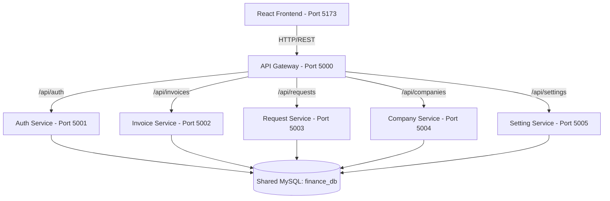
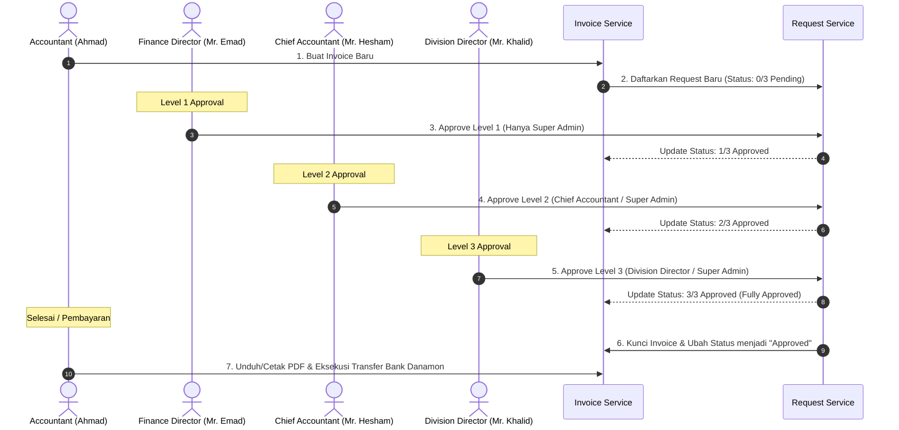

# 💼 Manazil AL.Mukhtara Group - Finance System

Sistem Keuangan Terintegrasi (Finance System) **Manazil AL.Mukhtara Group** adalah platform berbasis web yang dirancang khusus untuk mengelola operasional keuangan, pencatatan transaksi, katalog layanan pariwisata/umrah, manajemen kantor cabang, serta sistem persetujuan faktur (invoice approval) multi-tahap.

Aplikasi ini menggunakan arsitektur **Microservices** di sisi backend untuk modularitas tinggi dan performa optimal, serta **Single Page Application (SPA)** di sisi frontend untuk antarmuka pengguna yang dinamis, interaktif, dan premium.

---

## 🛠️ Arsitektur Teknologi

Sistem dibangun dengan menggunakan teknologi modern untuk menjamin performa, keamanan, dan skalabilitas:



### 1. Backend (Microservices)
Setiap layanan backend dibangun menggunakan **Node.js (Express framework, ESM)** dan berkomunikasi secara independen ke database MySQL bersama (`finance_db`).
*   **`api-gateway` (Port 5000)**: Pintu masuk utama (reverse proxy) yang menyatukan seluruh layanan backend menggunakan `http-proxy-middleware` dan mengelola CORS untuk komunikasi dengan frontend.
*   **`auth-service` (Port 5001)**: Menangani pendaftaran, login, autentikasi berbasis JSON Web Token (JWT), enkripsi kata sandi menggunakan `bcryptjs`, pencatatan log masuk, sesi pengguna, serta pengiriman email notifikasi (`nodemailer`).
*   **`invoice-service` (Port 5002)**: Mengelola pencatatan invoice masuk dan detail rincian item transaksi belanja.
*   **`request-service` (Port 5003)**: Pusat logika bisnis untuk pengajuan dan pemrosesan approval bertingkat (3 level approval).
*   **`company-service` (Port 5004)**: Mengelola data entitas atau mitra bisnis/klien (perusahaan eksternal).
*   **`setting-service` (Port 5005)**: Mengelola konfigurasi sistem meliputi pengelolaan tim, kantor cabang operasional, preferensi notifikasi, nilai tukar mata uang asing harian (USD, SAR, IDR), profil pengguna, keamanan, dan katalog harga layanan standar.

### 2. Frontend (Single Page Application)
Aplikasi antarmuka pengguna dibangun dengan:
*   **React (v19)** & **TypeScript** untuk pengembangan antarmuka terstruktur dan aman.
*   **Vite** sebagai build tool super cepat.
*   **Tailwind CSS** untuk desain tata letak UI yang modern dan responsif.
*   **React Router Dom** untuk navigasi halaman tanpa reload.
*   **Axios** untuk integrasi panggilan API terpusat.
*   **Lucide React** sebagai pustaka ikon visual premium.

---

## 🗄️ Struktur Database (MySQL)

Sistem menggunakan database relational **MySQL** dengan tabel berawalan `dst_`:

| Nama Tabel | Deskripsi Data | Layanan Pengelola |
| :--- | :--- | :--- |
| `dst_users` | Menyimpan kredensial pengguna, peran, kantor cabang, dan data profil. | `auth-service` / `setting-service` |
| `dst_sessions` | Menyimpan riwayat sesi perangkat aktif pengguna saat ini. | `auth-service` / `setting-service` |
| `dst_login_logs` | Menyimpan catatan audit log masuk (IP, browser, status). | `auth-service` |
| `dst_notifications` | Menyimpan pesan pemberitahuan in-app untuk pengguna. | `auth-service` |
| `dst_companies` | Menyimpan daftar perusahaan klien/mitra pariwisata. | `company-service` |
| `dst_invoices` | Menyimpan data header invoice (nomor, total biaya, rate konversi). | `invoice-service` |
| `dst_invoice_items` | Menyimpan baris detail barang/layanan dalam setiap invoice (Relasi One-to-Many). | `invoice-service` |
| `dst_requests` | Menyimpan status pengajuan persetujuan dan waktu tanda tangan tiap level. | `request-service` |
| `dst_branches` | Menyimpan data kantor cabang operasional perusahaan di Indonesia. | `setting-service` |
| `dst_notification_settings` | Menyimpan preferensi notifikasi tiap user (Email/In-App). | `setting-service` |
| `dst_exchange_rates` | Menyimpan data nilai tukar mata uang terkini (USD/SAR/IDR). | `setting-service` |
| `dst_exchange_rates_history` | Menyimpan riwayat perubahan nilai tukar harian (audit log). | `setting-service` |
| `dst_services` | Menyimpan katalog jenis layanan standar (Visa, Transport, Handling). | `setting-service` |
| `dst_company_settings` | Menyimpan konfigurasi profil / identitas perusahaan (nama perusahaan, kontak, NPWP, syarat & ketentuan) untuk kop faktur. | `setting-service` |

---

## 🔄 Alur Kerja Aplikasi (Application Workflow)

Alur kerja operasional utama sistem keuangan ini dirancang untuk menjaga transparansi dan validasi transaksi:



### 1. Otentikasi dan Matriks Peran Pengguna
Pengguna harus masuk dengan salah satu peran (role) yang menentukan wewenang mereka dalam sistem persetujuan:
*   **Super Admin** (Direktur Keuangan / *Finance Director* - **Mr. Emad Moustafa**): Memiliki wewenang penuh atas konfigurasi sistem serta dapat memberikan persetujuan pada Level 1, 2, maupun 3.
*   **Chief Accountant** (Kepala Akuntan - **Mr. Hesham Ahmed**): Bertanggung jawab atas verifikasi kepatuhan keuangan pada Level 2.
*   **Division Director** (Direktur Divisi Umrah - **Mr. Khalid Idriss**): Bertanggung jawab atas persetujuan akhir operasional pada Level 3.
*   **Accountant** (Staf Akuntan - **Ahmad Saleh**): Membuat invoice, mendaftarkan request, memantau persetujuan, dan melakukan eksekusi pembayaran.

### 2. Siklus Pembuatan Invoice & Persetujuan Multi-Tahap (3-Level Approval System)
1.  **Penginputan**: Staf Akuntan menginput invoice baru atas transaksi belanja operasional atau pariwisata (misal: pengadaan Visa Umrah, pemesanan hotel, atau sewa bus). Saat pembuatan invoice, staf juga memilih nilai tukar harian (USD/SAR ke IDR).
2.  **Pengajuan**: Sistem membuat draft invoice dan secara otomatis mengajukan permintaan persetujuan (`dst_requests`) dengan status awal **`0/3 Pending`**.
3.  **Proses Persetujuan Tingkat 1 (Level 1)**:
    *   *Penanggung Jawab*: Harus disetujui oleh **Super Admin** (Mr. Emad Moustafa).
    *   *Hasil*: Jika disetujui, status berubah menjadi **`1/3 Approved`** dan mencatat waktu `level1ApprovedAt`.
4.  **Proses Persetujuan Tingkat 2 (Level 2)**:
    *   *Penanggung Jawab*: Harus disetujui oleh **Chief Accountant** (Mr. Hesham) atau Super Admin.
    *   *Hasil*: Jika disetujui, status berubah menjadi **`2/3 Approved`** dan mencatat waktu `level2ApprovedAt`.
5.  **Proses Persetujuan Tingkat 3 (Level 3)**:
    *   *Penanggung Jawab*: Harus disetujui oleh **Division Director** (Mr. Khalid Idriss) atau Super Admin.
    *   *Hasil*: Jika disetujui, status berubah menjadi **`3/3 Approved`** (Fully Approved) dan mencatat waktu `level3ApprovedAt`.
6.  **Pemberatan Keputusan (Rejection)**:
    *   Setiap pengambil keputusan (Super Admin, Chief Accountant, atau Division Director) dapat menolak (*Reject*) pengajuan.
    *   Staf Accountant **tidak diizinkan** menolak pengajuan.
    *   Jika ditolak, status request dan invoice langsung terkunci menjadi **`Rejected`** dan alur dihentikan.

### 3. Eksekusi Pembayaran & Cetak Faktur
*   Sebelum invoice berstatus **`3/3 Approved`**, fitur **Cetak (Print)** dan **Unduh PDF (Download PDF)** dalam keadaan terkunci (locked).
*   Setelah status mencapai **`3/3 Approved`**, tombol cetak dan unduh akan aktif secara otomatis.
*   Akuntan dapat mengunduh invoice resmi yang menyertakan metadata tanda tangan digital (waktu persetujuan dari masing-masing level) serta instruksi transfer pembayaran ke Bank Danamon PT ODST Airlines Indo.
*   Setelah pembayaran didepositkan, status dapat ditandai sebagai *Paid* (Terbayar).

---

## 🚀 Panduan Memulai (Quick Start)

### Prasyarat
*   **Node.js** (Minimal v18+)
*   **MySQL Server** (Pastikan service MySQL berjalan di localhost)

### 1. Instalasi Dependensi
Anda dapat menginstal dependensi untuk root workspace, seluruh 6 microservices backend, dan React frontend sekaligus menggunakan script otomatis yang sudah disediakan di file root `package.json`:

Jalankan perintah berikut di root folder proyek:
```bash
npm run install:all
```

### 2. Konfigurasi Lingkungan (.env)
Pastikan setiap folder layanan di bawah `backend/` dan folder `finance-frontend/` sudah memiliki file `.env` yang terkonfigurasi dengan benar:

*   **Database Config (Backend Services)**:
    Sesuaikan variabel `DB_HOST`, `DB_USER`, `DB_PASSWORD`, dan `DB_NAME` (secara default akan membuat database `finance_db` secara otomatis saat service pertama kali dijalankan).
*   **Gateway URL (Frontend & Gateway)**:
    Pastikan service gateway mengarah ke port microservice yang tepat, dan frontend mengarah ke port gateway (`http://localhost:5000`).

### 3. Menjalankan Aplikasi di Lingkungan Pengembangan (Development Mode)
Untuk menjalankan seluruh microservices backend dan frontend secara bersamaan dengan satu perintah saja, jalankan script berikut di terminal root folder:

```bash
npm run dev
```

Script ini menggunakan library `concurrently` untuk mengorkestrasi jalannya layanan-layanan berikut secara paralel:
1.  **Auth Service** (Port 5001)
2.  **Invoice Service** (Port 5002)
3.  **Request Service** (Port 5003)
4.  **Company Service** (Port 5004)
5.  **Setting Service** (Port 5005)
6.  **API Gateway** (Port 5000)
7.  **React Frontend** (Port 5173)

Setelah berjalan, Anda dapat mengakses antarmuka pengguna sistem keuangan di alamat: **`http://localhost:5173`**.

---
*Dokumentasi ini dibuat untuk mempermudah onboarding pengembang dan memberikan gambaran menyeluruh terhadap sistem keuangan Manazil AL.Mukhtara Group.*
