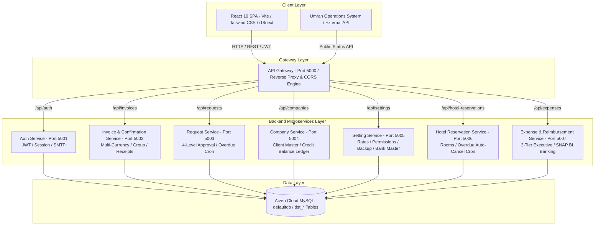
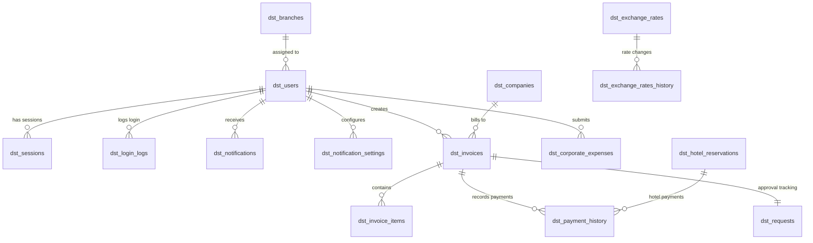
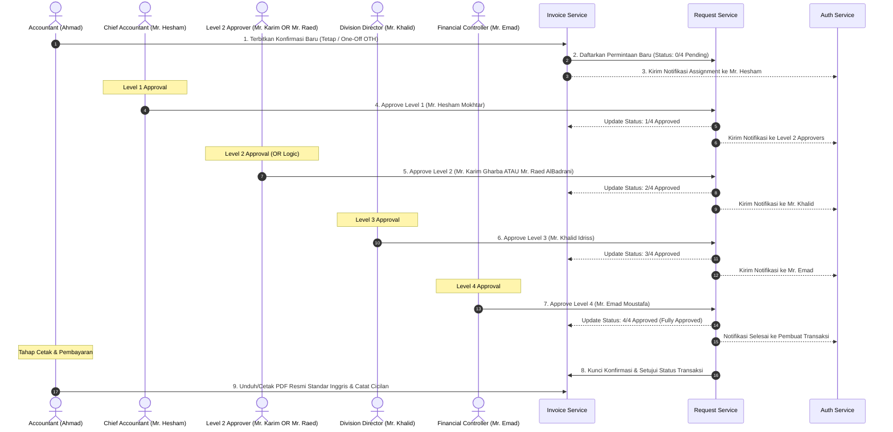

# 💼 Manazil AL.Mukhtara Group - Finance System

[](https://github.com/dimasalvarizk/finance-system)
[](https://nodejs.org/)
[](https://react.dev/)
[](https://aiven.io/)
[](https://coolify.io/)
[-red.svg)](https://react.i18next.com/)

**Sistem Keuangan Terintegrasi (Finance System) Manazil AL.Mukhtara Group** adalah platform enterprise berbasis web modern yang dirancang khusus untuk mengelola operasional finansial global, penerbitan konfirmasi transaksi resmi (*Confirmations*), rekonsiliasi multi-valuta otomatis (*Multi-Currency Engine*), saldo kredit klien (*Client Credit Balance*), reservasi hotel & akomodasi umrah/haji, katalog layanan pariwisata, laporan keuangan cabang & perusahaan berstandar A4 PDF, sistem izin dinamis (*Dynamic Permissions*), notifikasi otomatis (*In-App & Email*), alur persetujuan konfirmasi 4-tahap (*Confirmation 4-Level Approval*), serta modul operasional internal (*Internal Expenses, 3-Tier Executive Authorization & Host-to-Host Bank BNI SNAP BI Disbursement*).

Aplikasi ini menggunakan arsitektur **Microservices** di sisi backend untuk modularitas, ketahanan tinggi, dan skalabilitas optimal, serta **Single Page Application (SPA)** di sisi frontend untuk antarmuka pengguna yang dinamis, interaktif, responsif, berkinerja tinggi, dan berstandar internasional.

---

## 📑 Daftar Isi

1. [Arsitektur & Topologi Sistem](#-arsitektur--topologi-sistem)
2. [Layanan Backend (8 Microservices + API Gateway)](#-layanan-backend-8-microservices--api-gateway)
3. [Arsitektur Frontend (React 19 SPA)](#-arsitektur-frontend-react-19-spa)
4. [Fitur Utama Sistem Keuangan](#-fitur-utama-sistem-keuangan)
   - [1. Modul Confirmations & Rekonsiliasi Multi-Valuta](#1-modul-confirmations--rekonsiliasi-multi-valuta)
   - [2. Group Number & Nationality Synchronization](#2-group-number--nationality-synchronization)
   - [3. Laporan Keuangan Perusahaan & Cabang (A4 PDF Export)](#3-laporan-keuangan-perusahaan--cabang-a4-pdf-export)
   - [4. Kuitansi Deposit Resmi & Micro-Interactions](#4-kuitansi-deposit-resmi--micro-interactions)
   - [5. Master Pengaturan Rekening Bank (CIF, SWIFT & Branch)](#5-master-pengaturan-rekening-bank-cif-swift--branch)
   - [6. Modul Internal Expenses & Reimbursement (3-Tier & SNAP BI)](#6-modul-internal-expenses--reimbursement-3-tier--snap-bi)
   - [7. Dukungan Penuh Trilingual (ID, EN, AR) & Proteksi PDF](#7-dukungan-penuh-trilingual-id-en-ar--proteksi-pdf)
   - [8. Integrasi Eksternal (Umrah Operations System Status API)](#8-integrasi-eksternal-umrah-operations-system-status-api)
   - [9. Background Cron Job Terjadwal (Overdue Checkers)](#9-background-cron-job-terjadwal-overdue-checkers)
   - [10. Dynamic Permission Matrix & Super Admin Control Center](#10-dynamic-permission-matrix--super-admin-control-center)
   - [11. Optimasi Performa UI & Render Virtual](#11-optimasi-performa-ui--render-virtual)
5. [Struktur Database (18 Tabel MySQL)](#-struktur-database-18-tabel-mysql)
6. [Alur Kerja Persetujuan (Workflows & Diagrams)](#-alur-kerja-persetujuan-workflows--diagrams)
7. [Struktur Direktori Proyek](#-struktur-direktori-proyek)
8. [Panduan Instalasi & Menjalankan Sistem](#-panduan-instalasi--menjalankan-sistem)
9. [Konfigurasi Environment (.env)](#-konfigurasi-environment-env)
10. [Panduan Deployment Docker & VPS Coolify](#-panduan-deployment-docker--vps-coolify)

---

## 🛠️ Arsitektur & Topologi Sistem

Platform ini mengadopsi arsitektur terdistribusi modern di mana seluruh komunikasi klien terpusat melalui **API Gateway Reverse Proxy**, kemudian diteruskan ke layanan microservices independen yang terhubung ke basis data **Aiven Cloud MySQL (`dst_tables`)**:



---

## 📦 Layanan Backend (8 Microservices + API Gateway)

Setiap layanan backend dibangun menggunakan **Node.js (Express framework, ESM)** dengan isolasi tanggung jawab (*single responsibility principle*):

| Layanan | Port | Path Prefix | Tanggung Jawab Utama |
| :--- | :---: | :--- | :--- |
| **`api-gateway`** | `5000` | `/api/*` | Pintu masuk utama (*reverse proxy* via `http-proxy-middleware`), manajemen CORS lintas subdomain `*.odstfin.io`, Coolify domains, dan header `Access-Control-Allow-Private-Network`. |
| **`auth-service`** | `5001` | `/api/auth` | Autentikasi JWT, enkripsi `bcryptjs`, audit log masuk, pelacakan dan pencabutan sesi aktif pengguna, serta pengiriman email SMTP (`nodemailer`). |
| **`invoice-service`** | `5002` | `/api/invoices` | Pencatatan konfirmasi transaksi, penanganan klien manual *One-Off* (`OTH-*`), sinkronisasi `group_number` & `nationality`, pembayaran bertahap, kuitansi deposit resmi, rekonsiliasi multi-valuta (USD/SAR/IDR), dan status lookup publik. |
| **`request-service`** | `5003` | `/api/requests` | Pusat alur persetujuan bertingkat 4 level konfirmasi eksternal, validasi izin unduh PDF, dan cron checker jatuh tempo harian pukul 08:00 AM. |
| **`company-service`** | `5004` | `/api/companies` | Master data mitra korporat, kode agen, buku besar saldo kredit (*credit balance ledger*), dan audit trail reset saldo manual. |
| **`setting-service`** | `5005` | `/api/settings` | Konfigurasi sistem: manajemen tim, kantor cabang, preferensi notifikasi, kurs harian & riwayat, katalog harga layanan, master rekening bank (CIF, SWIFT, branch address), backup 18 tabel MySQL, dan Dynamic Permissions Matrix. |
| **`hotel-reservation-service`** | `5006` | `/api/hotel-reservations` | Siklus reservasi hotel, alokasi tipe kamar & meal, verifikasi Mr. Karim Gharba, sinkronisasi nomor grup & kewarganegaraan, riwayat cicilan hotel, dan cron pemindaian auto-cancel saat jatuh tempo. |
| **`expense-service`** | `5007` | `/api/expenses` | Pengajuan klaim biaya internal (*Internal Expenses*), unggah nota digital, rantai otorisasi 3-tier eksekutif, inkuiri rekening SNAP BI, review pre-execution payout, dan audit settlement transfer. |

---

## 💻 Arsitektur Frontend (React 19 SPA)

Aplikasi antarmuka pengguna dirancang untuk memberikan pengalaman navigasi instan tanpa jeda, hemat memori, dan ramah pengguna lintas bahasa:

* **React (v19) & TypeScript**: Fondasi komponen modern, modular, dan type-safe.
* **Vite**: Build pipeline berkecepatan tinggi dengan code splitting otomatis.
* **Tailwind CSS**: Tata letak responsif, modern, dan utilitas styling konsisten.
* **Performa Ultra Cepat**: Eliminasi efek blur berat (`backdrop-blur`) pada modal dan tabel guna menghilangkan rendering lag pada perangkat dengan spesifikasi standar atau koneksi terbatas.
* **i18next & react-i18next**: Sistem translasi trilingual instan (Indonesia, English, Arabic) dengan dukungan RTL (Right-to-Left).
* **React Router Dom (v7)**: Navigasi SPA dinamis yang dilengkapi Route Guards, Lazy Loading, Page Loaders, dan Dynamic SEO Meta Management.
* **Lucide React & Micro-Interactions**: Ikonografi modern, tombol salin instan (*copy with feedback*), badge status interaktif, dan toast pemberitahuan real-time.

---

## ✨ Fitur Utama Sistem Keuangan

### 1. Modul Confirmations & Rekonsiliasi Multi-Valuta
* **Nomenklatur Resmi**: Label menu dan transaksi terstandarisasi menjadi **Confirmations** (*التأكيدات* / *Konfirmasi*).
* **Cross-Currency Conversion Engine**:
  * Pembayaran klien dalam mata uang berbeda (misal: pembayaran IDR untuk tagihan berdenominasi SAR atau USD) secara otomatis dikonversi menggunakan kurs transaksi harian.
  * Mencegah pembengkakan saldo kredit akibat perbedaan valuta dan menghitung *collected cash inflow* riil secara presisi.
* **Klien One-Off ("Others")**: Opsi pencatatan transaksi langsung tanpa mencemari master data perusahaan tetap, otomatis diberi nomor konfirmasi dengan prefix `OTH-` (contoh: `OTH-0903-001`).

### 2. Group Number & Nationality Synchronization
* **Data Grup & Kewarganegaraan Terintegrasi**: Konfirmasi transaksi dan Reservasi Hotel kini mendukung kolom opsional **Group Number** (`group_number`) dan **Nationality** (`nationality`).
* **Sinkronisasi Presisi**: Data disimpan secara permanen di database (`dst_invoices` & `dst_hotel_reservations`) dan otomatis dipetakan pada dokumen cetak PDF.
* **A4 PDF Auto-Layout**: Tampilan data grup dan kewarganegaraan disusun berdampingan (*side-by-side*) dengan nomor referensi konfirmasi untuk mencegah layout bergeser atau meluap ke halaman kedua.

### 3. Laporan Keuangan Perusahaan & Cabang (A4 PDF Export)
* **Company Financial Report Modal & PDF**:
  * Tampilan analitik terperinci per perusahaan: total omset, tagihan lunas, tagihan tertunda (*pending/overdue*), total saldo kredit (*credit balance*), dan rincian transaksi terkait.
  * Format cetak A4 PDF profesional dengan format nominal 2 desimal presisi dan perhitungan jatuh tempo yang tersinkronisasi dengan dashboard.
* **Branch Financial Report**: Ringkasan performa finansial kantor cabang (Jakarta, Madinah, Surabaya, dll.) yang dapat dicetak dan ditinjau oleh pimpinan eksekutif.

### 4. Kuitansi Deposit Resmi & Micro-Interactions
* **Official Deposit Receipt Generator**: Cetak dan unduh kuitansi bukti pembayaran uang muka (*deposit*) atau cicilan bertahap (*installment*) dengan stempel & tanda tangan resmi Manazil AL.Mukhtara.
* **One-Click Copy Confirmation**: Interaksi mikro penyalinan nomor konfirmasi ke clipboard dengan feedback visual instan (*toast tooltip*).

### 5. Master Pengaturan Rekening Bank (CIF, SWIFT & Branch)
* **Kelengkapan Data Perbankan Internasional**: Modul Company Bank Settings mendukung konfigurasi detail:
  * **Bank Branch Address** (Alamat Cabang Bank).
  * **CIF Number** (Customer Information File).
  * **SWIFT / BIC Code** untuk transaksi transfer internasional lintas negara.
* **Pencetakan Otomatis pada PDF**: Seluruh instruksi transfer pada invoice dan konfirmasi resmi otomatis mencantumkan data perbankan lengkap untuk mempermudah transfer valuta asing klien korporat.

### 6. Modul Internal Expenses & Reimbursement (3-Tier & SNAP BI)
* **My Expenses (`/my-expenses`)**: Dasbor pelacakan status pengajuan klaim staf secara real-time.
* **Submit Expense (`/submit-expense`)**: Pengajuan klaim biaya operasional lengkap dengan drag-and-drop nota/kuitansi digital (*support PDF, JPG, PNG, WEBP hingga 15MB*).
* **Rantai Otorisasi 3 Tingkat Eksekutif**:
  1. **Tahap 1**: Mr. Hesham Mokhtar (*Finance Director*)
  2. **Tahap 2**: Mr. Khalid Idriss (*Branch General Manager*)
  3. **Tahap 3**: Mr. Emad Moustafa (*Financial Controller / Treasury*)
* **Integrasi Host-to-Host Bank BNI SNAP BI**:
  * Fitur inkuiri nama rekening tujuan (*account inquiry*) dan verifikasi data rekening.
  * Status eksekusi transfer saat ini ditahan (*on hold*) pada tahap 3-Tier Approval selesai sambil menunggu aktivasi API gateway produksi Bank BNI; pencairan dapat diproses manual/payroll dengan jejak audit kriptografis SHA-256.
* **Dual-Environment Flag (`VITE_ENABLE_INTERNAL`)**:
  * Pada server produksi standar, modul internal ditampilkan sebagai menu berlabel `INTERNAL (coming soon)`.
  * Pada server testing/staging (`VITE_ENABLE_INTERNAL=true`), seluruh alur internal dapat dievaluasi secara menyeluruh.

### 7. Dukungan Penuh Trilingual (ID, EN, AR) & Proteksi PDF
* **3 Bahasa Resmi**: Pilihan bahasa antarmuka **Bahasa Indonesia (`id`)**, **English (`en`)**, dan **Arabic (`ar`)** dengan tata letak RTL otomatis.
* **Proteksi Integritas Cetak PDF**: Seluruh berkas cetak resmi (Konfirmasi, Laporan Finansial, Reservasi Hotel, Kuitansi Deposit, Voucher Audit) **tetap 100% dalam bahasa Inggris berstandar internasional** tanpa terpengaruh oleh bahasa antarmuka UI pengguna saat mencetak.

### 8. Integrasi Eksternal (Umrah Operations System Status API)
* **Public Status Lookup API**: Endpoint publik `GET /api/invoices/:invoiceNo/status` yang aman dan efisien memungkinkan ekosistem eksternal (seperti **Umrah Operations System**) untuk melakukan verifikasi status pelunasan konfirmasi secara real-time tanpa perlu autentikasi sesi penuh.

### 9. Background Cron Job Terjadwal (Overdue Checkers)
* **Request Service Cron (`overdueChecker.js`)**: Memeriksa antrean approval konfirmasi (`dst_requests`) setiap hari pukul **08:00 AM** dan memicu notifikasi peringatan keterlambatan (*overdue approval alert*) ke approver terkait.
* **Hotel Reservation Service Cron (`overdueChecker.js`)**: Memindai reservasi hotel aktif (`dst_hotel_reservations`) yang belum lunas dan melewati batas waktu jatuh tempo, secara otomatis mengubah status menjadi **Cancelled** (*Auto-Cancelled: Unpaid past due date*) serta mengirimkan alert anti-duplikasi.

### 10. Dynamic Permission Matrix & Super Admin Control Center
* **Granular Matrix Control**: Super Admin dapat mengelola hak akses per pengguna secara dinamis dari UI tanpa memerlukan redeployment sistem:
  * ⚡ **Bypass Approval** (`CAN_BYPASS_APPROVAL`): Hak khusus (contoh: Mr. Khalid) untuk membuat konfirmasi yang langsung disahkan (status `Approved` / `4/4 Approved`).
  * 👥 **Add Team Members** (`CAN_ADD_MEMBERS`): Hak menambah anggota tim baru.
  * 🛡️ **Edit/Manage Logs** (`CAN_EDIT_SYSTEM_LOGS`): Izin mengelola dan mengedit catatan audit sistem.
  * 📊 **View All Reports** (`CAN_VIEW_ALL_REPORTS`): Izin melihat laporan keuangan seluruh cabang.
* **Super Admin Control Center (`/super-admin/dashboard`)**: Ruang kontrol eksklusif Developer & Super Admin (**Dimas & Ali**) yang dilindungi oleh middleware backend `isSuperAdmin` dan frontend Route Guard.

### 11. Optimasi Performa UI & Render Virtual
* **Zero Lag Scrolling**: Penghapusan efek *backdrop-blur* berat pada elemen modal besar dan tabel data master menghasilkan respon antarmuka yang sangat mulus pada semua perangkat.
* **Optimized Modal Lifecycle**: Pengelolaan state modal dan dropzone file yang dioptimalkan untuk meminimalkan re-render komponen React.

---

## 🗄️ Struktur Database (18 Tabel MySQL)

Sistem beroperasi di atas basis data relasional **Aiven Cloud MySQL 8.0** dengan skema tabel terstruktur berawalan `dst_`:



### Rincian Tabel Sistem:

| # | Nama Tabel | Deskripsi & Isi Data | Layanan Terkait |
| :-: | :--- | :--- | :--- |
| **1** | `dst_users` | Kredensial pengguna, password hash, role, cabang, permissions JSON matrix. | `auth-service`, `setting-service` |
| **2** | `dst_sessions` | Token sesi aktif dan status perangkat login pengguna. | `auth-service` |
| **3** | `dst_login_logs` | Catatan audit aktivitas login (IP address, User Agent, status keberhasilan). | `auth-service` |
| **4** | `dst_notifications` | Notifikasi in-app pengguna (judul, pesan, tipe, status belum dibaca). | `auth-service` |
| **5** | `dst_notification_settings`| Preferensi saluran notifikasi pengguna (Email & In-App per jenis notifikasi). | `setting-service` |
| **6** | `dst_audit_logs` | Jejak audit komprehensif sistem, perubahan perizinan, dan catatan manual. | `setting-service`, `invoice-service` |
| **7** | `dst_companies` | Master data mitra korporat, kode agen, email, telepon, dan saldo kredit (*credit balance*). | `company-service` |
| **8** | `dst_invoices` | Header konfirmasi transaksi, nomor referensi, `group_number`, `nationality`, total, sisa tagihan, kurs, status pembayaran, dan data klien *One-Off*. | `invoice-service` |
| **9** | `dst_invoice_items` | Baris rincian item layanan/produk di setiap konfirmasi transaksi. | `invoice-service` |
| **10** | `dst_payment_history` | Riwayat transaksi pembayaran bertahap/cicilan konfirmasi dan reservasi hotel. | `invoice-service`, `hotel-reservation-service` |
| **11** | `dst_requests` | Status alur persetujuan 4 tingkat konfirmasi (`level1` s/d `level4`, approver, note, timestamp). | `request-service` |
| **12** | `dst_branches` | Data kantor cabang perusahaan (Jakarta, Madinah, Jeddah, dll.). | `setting-service` |
| **13** | `dst_exchange_rates` | Nilai tukar mata uang asing harian (USD, SAR, IDR). | `setting-service` |
| **14** | `dst_exchange_rates_history` | Riwayat perubahan nilai kurs untuk jejak audit finansial. | `setting-service` |
| **15** | `dst_services` | Katalog standar jenis layanan dan tarif acuan pariwisata. | `setting-service` |
| **16** | `dst_company_settings` | Informasi profil perusahaan, alamat cabang bank, nomor CIF, SWIFT code, dan nomor rekening perbankan. | `setting-service` |
| **17** | `dst_hotel_reservations` | Data reservasi hotel, nomor grup, kewarganegaraan, rincian kamar (*rooms JSON*), tamu, status verifikasi Karim, dan jatuh tempo. | `hotel-reservation-service` |
| **18** | `dst_corporate_expenses` | Data pengajuan klaim biaya internal, nota digital, alur otorisasi 3-tier, data bank penerima, dan trace H2H settlement. | `expense-service` |

---

## 🔄 Alur Kerja Persetujuan (Workflows & Diagrams)

### 1. Alur Persetujuan Konfirmasi Eksternal (4-Level Approval)



### 2. Alur Klaim Biaya Internal & Pencairan Bank (3-Tier Executive & SNAP BI)


---

## 📂 Struktur Direktori Proyek

```text
FinanceSystem/
├── api/                                # Serverless proxy routes (jika dideploy di edge/Vercel)
├── backend/
│   ├── api-gateway/                    # Reverse proxy (Port 5000) & Subdomain CORS Handler
│   │   ├── Dockerfile
│   │   ├── server.js
│   │   └── package.json
│   ├── auth-service/                   # Layanan Auth, User, Session, & SMTP Email (Port 5001)
│   ├── invoice-service/                # Layanan Konfirmasi, Multi-Valuta, & Receipt (Port 5002)
│   ├── request-service/                # Layanan 4-Tier Approval & Overdue Cron (Port 5003)
│   ├── company-service/                # Layanan Master Mitra & Credit Ledger (Port 5004)
│   ├── setting-service/                # Layanan Konfigurasi, Kurs, Bank, & Backup (Port 5005)
│   ├── hotel-reservation-service/      # Layanan Reservasi Hotel & Auto-Cancel Cron (Port 5006)
│   └── expense-service/                # Layanan Klaim Biaya 3-Tier & SNAP BI (Port 5007)
├── finance-frontend/                   # Antarmuka Pengguna React 19 SPA
│   ├── public/                         # Aset publik, favicon, font
│   ├── src/
│   │   ├── assets/                     # Gambar, logo Manazil AL.Mukhtara, stempel resmi
│   │   ├── components/                 # Komponen modular (Confirmations, Modals, Reports, UI)
│   │   ├── context/                    # AuthContext, MaintenanceContext, LanguageContext
│   │   ├── hooks/                      # Custom React Hooks
│   │   ├── locales/                    # File kamus bahasa (id, en, ar)
│   │   ├── pages/                      # Halaman aplikasi (Dashboard, Invoices, Requests, dll.)
│   │   ├── routes/                     # Definisi rute, Guards, SEO Metadata, Lazy Loaders
│   │   ├── services/                   # Klien API Axios terpusat
│   │   ├── utils/                      # Helper format mata uang, tanggal, super admin auth
│   │   ├── App.tsx                     # Root Component
│   │   ├── index.css                   # Tailwind CSS styling
│   │   └── main.tsx                    # Entry Point SPA
│   ├── Dockerfile                      # Nginx production build Dockerfile
│   └── package.json
├── docker-compose.yml                  # Konfigurasi orkestrasi container Docker
├── package.json                        # Root package runner (Concurrently)
└── README.md                           # Dokumentasi komprehensif sistem
```

---

## 🚀 Panduan Instalasi & Menjalankan Sistem

### Prasyarat Perangkat Lunak
* **Node.js**: Versi `18.0.0` atau yang lebih baru.
* **MySQL Database**: Aiven Cloud MySQL atau MySQL Server lokal (v8.0+).
* **Git** & **Docker** (Opsional untuk deployment container).

### 1. Kloning Repositori
```bash
git clone https://github.com/dimasalvarizk/finance-system.git
cd finance-system
```

### 2. Instalasi Dependensi (Root, Seluruh Microservices & Frontend)
Gunakan perintah otomatis root workspace untuk mengunduh semua paket dependensi:
```bash
npm run install:all
```

### 3. Menjalankan Mode Pengembangan (Local Dev Mode)
Nyalakan seluruh 8 microservice backend dan frontend SPA secara simultan hanya dengan satu perintah:
```bash
npm run dev
```

* **Frontend Web**: Buka [http://localhost:5173](http://localhost:5173) di browser.
* **API Gateway**: Berjalan pada `http://localhost:5000`.

---

## ⚙️ Konfigurasi Environment (.env)

Pastikan file konfigurasi `.env` telah disiapkan pada masing-masing direktori layanan:

### 1. Backend Microservices (`backend/*-service/.env`)
Contoh variabel lingkungan untuk layanan backend (misal: `auth-service`, `invoice-service`, dll.):
```env
PORT=5001
NODE_ENV=development
DB_HOST=mysql-xxxxxx.aivencloud.com
DB_PORT=12345
DB_USER=avnadmin
DB_PASSWORD=your_aiven_password
DB_NAME=defaultdb
JWT_SECRET=your_super_secret_jwt_key

# Khusus auth-service (Pengiriman Email Notifikasi):
FRONTEND_URL=http://localhost:5173
SMTP_HOST=smtp.titan.email
SMTP_PORT=587
SMTP_SECURE=false
SMTP_USER=finance-notifications@manazil.com
SMTP_PASS=your_smtp_password
SMTP_FROM="Manazil Finance System" <finance-notifications@manazil.com>
```

### 2. API Gateway (`backend/api-gateway/.env`)
```env
PORT=5000
NODE_ENV=development
AUTH_SERVICE_URL=http://localhost:5001
INVOICE_SERVICE_URL=http://localhost:5002
REQUEST_SERVICE_URL=http://localhost:5003
COMPANY_SERVICE_URL=http://localhost:5004
SETTING_SERVICE_URL=http://localhost:5005
HOTEL_RESERVATION_SERVICE_URL=http://localhost:5006
EXPENSE_SERVICE_URL=http://localhost:5007
```

### 3. Frontend SPA (`finance-frontend/.env`)
```env
VITE_AUTH_API_URL=http://localhost:5000
VITE_INVOICE_API_URL=http://localhost:5000
VITE_REQUEST_API_URL=http://localhost:5000
VITE_SETTING_API_URL=http://localhost:5000
VITE_HOTEL_RESERVATION_API_URL=http://localhost:5000
VITE_EXPENSE_API_URL=http://localhost:5000

# Feature Flag untuk Modul Internal (true = aktif/testing, false = coming soon)
VITE_ENABLE_INTERNAL=false
```

---

## 🐳 Panduan Deployment Docker & VPS Coolify

### 1. Menjalankan dengan Docker Compose Lokal
```bash
docker compose up --build -d
```

### 2. Deployment pada VPS Coolify / Traefik Reverse Proxy
Arsitektur `docker-compose.yml` telah dioptimalkan khusus untuk lingkungan **Coolify**:
* Menggunakan direktif `expose` internal tanpa mengunci host port `80` atau `5000` secara kaku untuk mencegah bentrok port antar container.
* Traefik secara otomatis merutekan domain:
  * Frontend SPA: `https://odstfin.io` atau `https://finance.manazil.com`
  * API Gateway: `https://api.odstfin.io` atau `https://api-finance.manazil.com`
* **Pengaturan Lingkungan Coolify**:
  * **Testing / Staging**: Tambahkan `VITE_ENABLE_INTERNAL=true` di menu *Environment Variables*.
  * **Production**: Biarkan tanpa `VITE_ENABLE_INTERNAL` (default `false`) agar menu internal tertutup aman dengan label *Coming Soon*.

---

## 🔒 Catatan Keamanan & Kepatuhan Sistem

1. **Jejak Audit Kriptografis**: Setiap transaksi, mutasi kredit, bypass persetujuan, dan tindakan Super Admin tercatat pada `dst_audit_logs`.
2. **Kerahasiaan Kredensial**: File `.env` dan sertifikat database dikecualikan dari Git tracking (`.gitignore`).
3. **Penyimpanan Dokumen Cetak**: Seluruh faktur dan konfirmasi resmi yang diterbitkan terformat sesuai standar akuntansi internasional (English A4).

---

*Dokumentasi ini dikelola secara berkala untuk mencerminkan pembaruan fitur, keamanan, dan standar operasional Manazil AL.Mukhtara Group.*
