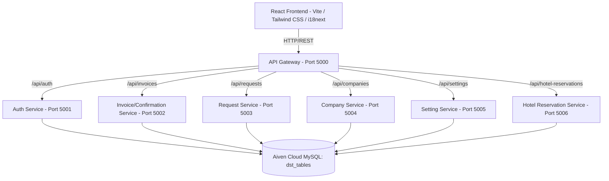
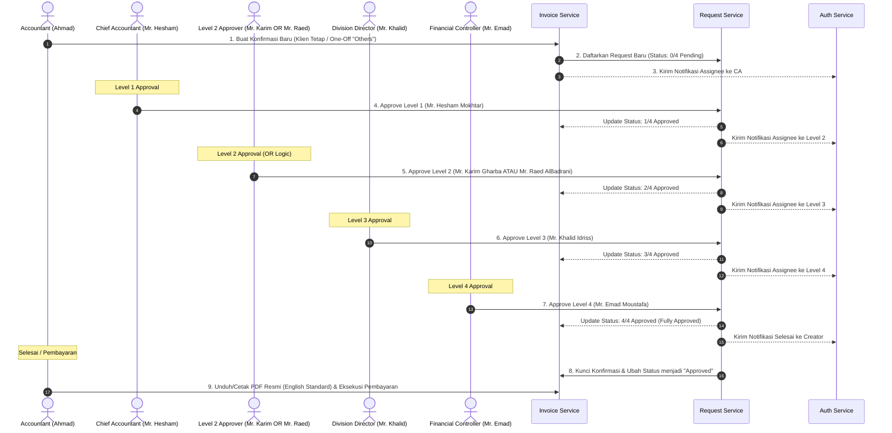

# 💼 Manazil AL.Mukhtara Group - Finance System

Sistem Keuangan Terintegrasi (Finance System) **Manazil AL.Mukhtara Group** adalah platform berbasis web enterprise yang dirancang khusus untuk mengelola operasional keuangan, pencatatan konfirmasi transaksi (*Confirmations*), reservasi hotel & akomodasi umrah/haji, katalog layanan pariwisata, manajemen kantor cabang, backup data sistem, riwayat pembayaran bertahap (*installments*), notifikasi otomatis (*In-App & Email*), input klien manual (*one-off client*), dukungan multibahasa (*i18n*), sistem persetujuan konfirmasi (*Confirmation Approval*) multi-tahap, serta modul operasional internal (*Internal Expenses & Reimbursement Management*).

Aplikasi ini menggunakan arsitektur **Microservices** di sisi backend untuk modularitas tinggi dan performa optimal, serta **Single Page Application (SPA)** di sisi frontend untuk antarmuka pengguna yang dinamis, interaktif, responsif, dan premium.

---

## 🛠️ Arsitektur Teknologi

Sistem dibangun dengan menggunakan teknologi modern untuk menjamin performa, keamanan, dan skalabilitas tinggi:



### 1. Backend (Microservices)
Setiap layanan backend dibangun menggunakan **Node.js (Express framework, ESM)** dan berkomunikasi secara independen ke database Aiven Cloud MySQL bersama (`dst_tables`):
* **`api-gateway` (Port 5000)**: Pintu masuk utama (*reverse proxy*) yang menyatukan seluruh layanan backend menggunakan `http-proxy-middleware` dan mengelola CORS untuk komunikasi dengan frontend.
* **`auth-service` (Port 5001)**: Menangani registrasi, login, autentikasi berbasis JSON Web Token (JWT), enkripsi kata sandi menggunakan `bcryptjs`, audit log masuk, pelacakan sesi pengguna, serta pusat pengiriman email notifikasi (`nodemailer` / SMTP).
* **`invoice-service` (Port 5002)**: Mengelola pencatatan konfirmasi masuk (*Confirmations*), klien *one-off* manual, rincian item transaksi belanja, riwayat pembayaran bertahap (*multi-payment installments*), serta kredit saldo overpayment perusahaan.
* **`request-service` (Port 5003)**: Pusat logika bisnis untuk pengajuan dan pemrosesan approval bertingkat (4-level approval system) serta cron checker jatuh tempo untuk antrean persetujuan.
* **`company-service` (Port 5004)**: Mengelola data entitas atau mitra bisnis/klien tetap (perusahaan terdaftar) serta saldo kredit (*credit balance*).
* **`setting-service` (Port 5005)**: Mengelola konfigurasi sistem meliputi manajemen tim, kantor cabang operasional, preferensi notifikasi pengguna, nilai tukar mata uang asing harian (USD, SAR, IDR), profil pengguna, keamanan akun, backup sistem, dan katalog harga layanan standar.
* **`hotel-reservation-service` (Port 5006)**: Mengelola seluruh siklus reservasi hotel, daftar kamar & akomodasi, verifikasi persetujuan oleh Mr. Karim Gharba, unggah bukti transfer/invoice, riwayat pembayaran kamar, serta cron checker jatuh tempo dan auto-cancellation hotel.

### 2. Frontend (Single Page Application)
Aplikasi antarmuka pengguna dibangun dengan:
* **React (v19)** & **TypeScript** untuk pengembangan antarmuka terstruktur, modular, dan type-safe.
* **Vite** sebagai build tool ultra-cepat.
* **Tailwind CSS** untuk desain tata letak UI yang modern, responsif, dan elegan.
* **i18next** & **react-i18next** untuk sistem lokalisasi multibahasa (Indonesia, English, Arabic).
* **React Router Dom** untuk navigasi halaman tanpa reload.
* **Axios** untuk integrasi panggilan API terpusat dengan interceptor otentikasi JWT.
* **Lucide React** sebagai pustaka ikon visual premium.

---

## ✨ Fitur Utama Sistem Keuangan

### 1. Modul Confirmations (Pencatatan & Pelacakan Konfirmasi Transaksi)
* **Penggantian Nama Modul Resmi**: Label menu dan modul diseragamkan menjadi **Confirmations** (*التأكيدات* dalam bahasa Arab dan *Konfirmasi* dalam bahasa Indonesia) untuk mencerminkan proses penerbitan konfirmasi resmi transaksi eksternal.
* **Opsi Klien One-Off ("Others")**: Pilihan fleksibel untuk membuat konfirmasi tanpa menyimpan ke master data mitra tetap `dst_companies`, menjaga kebersihan master data.
* **Format Penomoran Otomatis**: Transaksi klien manual otomatis menggunakan format nomor konfirmasi dengan prefix `OTH` (contoh: `OTH-0903-001`).

### 2. Modul Internal Expenses & Reimbursement (Feature Flag Ready)
Sistem dilengkapi modul operasional internal untuk klaim biaya dan reimbursement tim:
* **My Expenses (`/my-expenses`)**: Melacak status pengajuan biaya operasional pribadi.
* **Submit Expense (`/submit-expense`)**: Formulir pengajuan klaim biaya operasional baru lengkap dengan upload bukti kuitansi (*receipt dropzone*).
* **Approvals (`/approvals`)**: Dashboard persetujuan klaim biaya internal untuk auditor dan manajer.
* **Alur Approval & Pencairan**:
  * *Expense Approval Action* (`/approvals/action/:id`): Verifikasi rincian kuitansi dan profil klaim.
  * *Initiate Reimbursement* (`/approvals/reimburse/:id`): Ringkasan pembayaran dan pemilihan metode transfer.
  * *Setup Beneficiary* (`/approvals/beneficiary/:id`): Pengaturan rekening bank penerima reimbursement.
  * *Pre-Execution Payment Review* (`/approvals/execute/:id`): Verifikasi pra-eksekusi, jejak audit kepatuhan (*audit trail*), dan dispatch pembayaran.
* **Dual-Environment Feature Flag (`VITE_ENABLE_INTERNAL`)**:
  * **Di Production (Sistem Utama)**: Bagian internal otomatis disembunyikan dan hanya menampilkan header kategori **`INTERNAL (coming soon)`** (Arab: `داخلي (قريباً)`).
  * **Di Testing**: Variabel `VITE_ENABLE_INTERNAL=true` membuka seluruh menu dan fitur internal untuk pengujian tim.

### 3. Dukungan Multibahasa Penuh (Internationalization / i18n)
* **3 Bahasa Resmi**: Sistem mendukung **Bahasa Indonesia (`id`)**, **English (`en`)**, dan **Arabic (`ar`)** di seluruh halaman aplikasi (Dashboard, Confirmations, Requests, Companies, Hotel Reservations, Settings, dan Modals).
* **Language Switcher Cepat**: Pengguna dapat mengganti bahasa kapan saja melalui dropdown pemilih bahasa di Header atas.
* **Proteksi Integritas Cetak PDF**: Seluruh dokumen cetak resmi (Konfirmasi, Laporan Finansial Cabang, Reservasi Hotel) **tetap 100% dalam bahasa Inggris standar internasional** tanpa terpengaruh oleh bahasa antarmuka UI.

### 4. Perhitungan Real-Time Total Revenue (Collected Cash Inflow)
* **Collected Cash Standard**: Kartu *Total Revenue* di dashboard menghitung arus kas riil yang telah diterima (100% dari konfirmasi yang telah approved/paid penuh **ditambah** porsi nominal yang telah dibayarkan pada invoice berstatus partial payment / deposit).
* **Outstanding Balance Otomatis**: Tagihan dengan status partial payment secara otomatis hanya menghitung sisa saldo yang belum terbayar (*remaining balance*).
* **Format Mata Uang USD Standar**: Nominal dalam mata uang USD disajikan secara bersih dengan simbol `$` standar (contoh: `$53.33`).
* **Status Badges Baru**: Tabel konfirmasi dilengkapi badge informatif: `Fully Paid` (hijau), `Partial Payment` (biru), dan `Deposit Paid` (amber/kuning).

### 5. Sistem Notifikasi Otomatis Menyeluruh (In-App & Email)
* **Kustomisasi Preferensi Mandiri**: Pengguna dapat mengatur preferensi penerimaan notifikasi via In-App (lonceng header & audio alert) dan/atau Email resmi di menu **Settings ➔ Notifications** (`dst_notification_settings`).
* **Kategori Notifikasi**:
  * **Confirmation Notifications**: *New confirmation submitted*, *Confirmation approved*, *Confirmation rejected*, *Payment received*.
  * **Approval Notifications**: *Approval request assigned*, *Approval completed*, *Approval overdue*.
  * **System Notifications**: *Security alerts*, *Team member changes*, *System maintenance*.

### 6. Background Cron Job Terjadwal (Dedicated Overdue Checkers)
* **`request-service` Cron (`overdueChecker.js`)**: Memeriksa antrean approval konfirmasi (`dst_requests`) setiap hari pukul **08:00 AM** dan mengirimkan alert `approvalOverdue` ke approver terkait.
* **`hotel-reservation-service` Cron (`overdueChecker.js`)**: Memindai reservasi hotel aktif (`dst_hotel_reservations`) yang belum lunas dan telah melewati batas `dueDate`, secara otomatis memperbarui status menjadi **Cancelled** (*Auto-Cancelled: Unpaid past due date*) dan mengirimkan alert anti-duplikasi.

### 7. Modul Hotel Reservations & Cetak PDF Presisi
* **Tab "Reservations" vs "Requests"**: Tab reservasi menampilkan data operasional aktif (`Confirmed`, `Tentative`, `Paid`, `Overdue`, `Cancelled`). Tab requests mencatat seluruh riwayat permintaan awal.
* **Alur Approval Mandiri Mr. Karim**: Verifikasi khusus reservasi kamar hotel oleh Mr. Karim Gharba dengan penerbitan nomor konfirmasi (`CNF-...`).
* **Format Dokumen Cetak Standar Internasional**: Format PDF invoice dan reservasi mencantumkan blok tanda tangan resmi Financial Controller (*Mr. Emad Moustafa*), posisi **Due Date** di bawah tanda tangan, dan metadata resmi *Graha Al Badgel, Jakarta, Indonesia 12740*.

### 8. Multi-Payment History & Overpayment Credit
* **Pencatatan Cicilan Bertahap**: Dukungan pencatatan pembayaran berulang/bertahap pada modul konfirmasi maupun reservasi hotel (`dst_payment_history`).
* **Kredit Lebih Bayar (*Overpayment Credit*)**: Kelebihan dana akumulasi pembayaran otomatis dialokasikan ke saldo kredit klien (*credit balance*) di `dst_companies` untuk transaksi mendatang.

### 9. Sistem Persetujuan 4-Level & Logika OR
* Alur persetujuan 4 Level terstruktur: `0/4 Pending -> 1/4 -> 2/4 -> 3/4 -> 4/4 Approved`.
* Khusus pada **Level 2**, sistem menerapkan **Logika OR (ATAU)**: persetujuan dapat disahkan oleh Mr. Karim Gharba **ATAU** Mr. Raed AlBadrani.
* Setiap level divalidasi ketat terhadap peran pengguna (`role`) yang sedang login.

### 10. Dynamic Permission Management & Super Admin Dashboard (`/super-admin/dashboard`)
* **Dynamic Permission Matrix**: Manajemen hak akses granular per individu secara real-time langsung dari antarmuka web tanpa perlu deploy ulang kode:
  * ⚡ **Bypass Approval** (`CAN_BYPASS_APPROVAL`): Pengguna istimewa (contoh: Mr. Khalid) dapat membuat konfirmasi yang langsung disahkan (status `Approved` / `4/4 Approved`), otomatis melewati alur persetujuan Level 1-4, meniadakan notifikasi ke Mr. Hesham, dan langsung menyajikan tombol unduh PDF resmi.
  * 👥 **Add Team Members** (`CAN_ADD_MEMBERS`): Memberikan izin menambah anggota tim baru.
  * 🛡️ **Edit/Manage Logs** (`CAN_EDIT_SYSTEM_LOGS`): Izin mengelola dan mengedit catatan audit sistem.
  * 📊 **View All Reports** (`CAN_VIEW_ALL_REPORTS`): Izin melihat seluruh ringkasan analitik dan laporan keuangan lintas cabang.
* **Super Admin Mini Dashboard**: Halaman kontrol eksklusif Developer & Super Admin (**Dimas & Ali**) yang diamankan di tingkat backend middleware (`isSuperAdmin`) dan frontend route guard:
  * **Tab 1: Dynamic Permission Matrix**: Matriks tabel interaktif seluruh staf sistem dengan toggle switch instan, metrik statistik hak akses, dan pencarian cepat.
  * **Tab 2: System Audit Logs Management**: Jejak audit komprehensif (`dst_audit_logs`) dengan filter aksi, pencarian kata kunci, tambah catatan audit manual, edit catatan log, dan hapus log usang.
* **Audit Trail Otomatis**: Setiap pembaruan izin pengguna dan penerbitan konfirmasi jalur bypass secara otomatis direkam ke dalam database audit sistem dengan timestamp, alamat IP, dan payload perubahan.

---

## 🗄️ Struktur Database (MySQL)

Sistem menggunakan database relasional **Aiven Cloud MySQL** dengan tabel berawalan `dst_`:

| Nama Tabel | Deskripsi Data | Layanan Pengelola |
| :--- | :--- | :--- |
| `dst_users` | Kredensial pengguna, peran (*role*), kantor cabang, data profil, dan izin granular (`permissions` JSON). | `auth-service` / `setting-service` |
| `dst_audit_logs` | Jejak audit sistem, pembaruan izin pengguna, bypass persetujuan, dan catatan administratif manual. | `setting-service` / `invoice-service` / `request-service` |
| `dst_sessions` | Riwayat sesi perangkat aktif pengguna. | `auth-service` / `setting-service` |
| `dst_login_logs` | Catatan audit aktivitas login (IP, User Agent, status). | `auth-service` |
| `dst_notifications` | Pesan notifikasi in-app untuk pengguna (title, message, unread status). | `auth-service` |
| `dst_notification_settings` | Preferensi toggle notifikasi tiap pengguna (Email & In-App per alert type). | `setting-service` |
| `dst_companies` | Daftar mitra/klien terdaftar, kode agen, dan saldo kredit (*credit balance*). | `company-service` |
| `dst_invoices` | Header konfirmasi transaksi (nomor, total, kurs konversi, jatuh tempo, status, sisa saldo, serta field klien custom *one-off*). | `invoice-service` |
| `dst_invoice_items` | Baris detail rincian barang/layanan dalam setiap konfirmasi. | `invoice-service` |
| `dst_payment_history` | Riwayat pencatatan pembayaran bertahap/cicilan untuk konfirmasi & hotel. | `invoice-service` / `hotel-reservation-service` |
| `dst_requests` | Status alur persetujuan 4 level (`level1Note` - `level4Note`, timestamp, approver). | `request-service` |
| `dst_branches` | Data kantor cabang operasional perusahaan. | `setting-service` |
| `dst_exchange_rates` | Data nilai kurs mata uang terkini (USD/SAR/IDR). | `setting-service` |
| `dst_exchange_rates_history` | Riwayat perubahan nilai kurs harian untuk audit trail. | `setting-service` |
| `dst_services` | Katalog harga dan jenis layanan standar pariwisata. | `setting-service` |
| `dst_company_settings` | Konfigurasi profil perusahaan dan nomor rekening perbankan. | `setting-service` |
| `dst_hotel_reservations` | Data reservasi hotel, kamar (*rooms JSON*), tamu, status verifikasi Karim, dan sisa saldo. | `hotel-reservation-service` |

---

## 🔄 Alur Kerja Persetujuan (Approval Workflow)



---

## 🚀 Panduan Memulai (Quick Start)

### Prasyarat
* **Node.js** (Minimal v18+)
* **MySQL Server** (Aiven Cloud MySQL atau MySQL Server lokal)
* **Git**

### 1. Instalasi Dependensi
Jalankan perintah berikut di direktori root proyek untuk menginstal seluruh dependensi backend dan frontend secara otomatis:
```bash
npm run install:all
```

### 2. Konfigurasi Lingkungan (.env)
Pastikan berkas `.env` telah dikonfigurasi pada masing-masing microservice dan frontend:
* `backend/auth-service/.env`
* `backend/invoice-service/.env`
* `backend/request-service/.env`
* `backend/company-service/.env`
* `backend/setting-service/.env`
* `backend/hotel-reservation-service/.env`
* `backend/api-gateway/.env`
* `finance-frontend/.env`

### 3. Menjalankan Aplikasi dalam Mode Pengembangan (Dev Mode)
Jalankan perintah berikut di root folder untuk menyalakan seluruh 7 microservice dan frontend secara bersamaan:
```bash
npm run dev
```
Setelah aktif:
* **Frontend**: Buka [http://localhost:5173](http://localhost:5173) di browser Anda.
* **API Gateway**: Berjalan pada `http://localhost:5000`.

### 4. Menjalankan Aplikasi Menggunakan Docker Compose (Produksi / VPS)
Untuk deployment terpadu menggunakan container Docker:
```bash
docker compose up --build -d
```

### 5. Pengaturan Environment Coolify (Testing vs Production)
Untuk mengatur ketersediaan modul internal pada Coolify:
* **Environment `testing`**: Tambahkan variabel `VITE_ENABLE_INTERNAL=true` di menu *Environment Variables* lalu deploy.
* **Environment `production`**: Tanpa variabel `VITE_ENABLE_INTERNAL` (default `false`), tampilan secara otomatis bersih dengan label `INTERNAL (coming soon)`.

---

*Dokumentasi ini terus diperbarui seiring dengan evolusi fitur dan penyempurnaan sistem keuangan Manazil AL.Mukhtara Group.*
